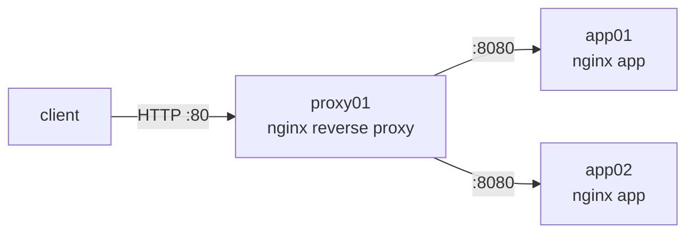

# Module 06 — Capstone: Multi-Host Deploy

**Goal:** prove your mastery by deploying a **load-balanced web application** across
multiple hosts — entirely with Ansible. A reverse proxy distributes traffic to two app
servers, and the whole thing is described as idempotent, reusable code. ⏱️ ~3+ h ·
🎯 Prereq: 00–05.

---

## The architecture



A request hits the **load balancer** (`proxy01`), which round-robins to **app01/app02**.
Each app server returns a page identifying *which* backend served it — so you can watch
the load balancing happen.

## What the project does

- **`common` role** (all hosts): base packages + a **default-deny firewall** (SSH allowed).
- **`app` role** (`web` group): installs nginx, opens the app port, serves a templated page
  that prints the backend's hostname/IP.
- **`loadbalancer` role** (`lb` group): installs nginx and renders an **upstream** block
  **generated from the `web` inventory group** (`groups['web']` + `hostvars[...]` facts) —
  so adding an app server is just adding it to the inventory.
- **`site.yml`**: two plays composing the roles.

This recreates — as code — the kind of by-hand server build you'd otherwise do manually,
now idempotent and scalable.

## Deploy it

```bash
cd ansible-course/06-capstone/code
# (adjust IPs in inventory.ini to your three hosts)
ansible-galaxy collection install community.general      # for the ufw module
ansible-playbook site.yml --check --diff                  # preview
ansible-playbook site.yml                                  # deploy
```

## Acceptance test (prove it works)

```bash
# Hit the load balancer several times — responses should alternate between backends:
for i in $(seq 6); do curl -s http://<proxy01-ip>/ | grep -o 'backend <strong>[^<]*'; done
#   backend <strong>app01
#   backend <strong>app02
#   backend <strong>app01
#   ... (round-robin)

# Idempotence: a second run changes nothing.
ansible-playbook site.yml          # PLAY RECAP: changed=0

# Scale out: add app03 to [web] in inventory.ini, then:
ansible-playbook site.yml          # the LB upstream is regenerated to include app03
```
✅ Traffic alternates across backends; re-running is idempotent; adding a host to the
inventory and re-running scales the pool automatically (the template reads `groups['web']`).

## Stretch goals

- Add a **vaulted** secret (an app `API_KEY`) rendered into an env file on the app servers
  (Module 05).
- Add a `monitoring` role (install `htop`/node tools) included only when
  `enable_monitoring=true`.
- Add **health checks** to the upstream (`max_fails`, `fail_timeout`) and a `/healthz`
  location on the apps.
- Split inventories into `staging` and `prod` with per-env `group_vars`.
- Add **handlers that validate** nginx config (`validate: nginx -t -c %s`) before reload.

---

## Mastery rubric (self-assess)

| Capability | Needs work | Solid | Mastery |
|------------|-----------|-------|---------|
| **Inventory** | one host | grouped (web/lb) | scales by editing inventory only |
| **Playbooks** | runs | idempotent (`changed=0` on re-run) | thin plays, logic in roles |
| **Modules** | uses `shell` | purpose-built modules | `creates`/`changed_when` where needed |
| **Variables/facts** | hardcoded | group_vars + facts | templates driven by `groups`/`hostvars` |
| **Templates** | static files | Jinja2 with vars | cross-host config (LB upstream from facts) |
| **Roles** | one big playbook | reusable roles | defaults vs vars, meta deps, Galaxy |
| **Secrets** | plaintext | Ansible Vault | per-env vaults, masked output |
| **Quality** | apply & pray | `--check`/lint | safe rollout: lint → check → staging → prod |

**You've reached the goal when** you can take a fresh set of servers and turn them into a
working, scalable, secure service with a single `ansible-playbook` run — and re-run it
safely any time.

## Reference solution
The complete, working project is in [`code/`](./code/). Build your own first; use this to
check yourself. A walkthrough is in [`solutions/walkthrough.md`](./solutions/walkthrough.md).

---

## 🎓 You finished the Ansible course
You went from a single ad-hoc `ping` to a load-balanced, idempotent, vaulted multi-host
deployment. Next steps:
- **Dynamic inventory & cloud** (AWS/GCP/Azure modules; `amazon.aws`).
- **Kubernetes from Ansible** (`kubernetes.core`) — pairs with the **Kubernetes course**.
- **Molecule** for role CI; **AWX/Ansible Automation Platform** for a UI + scheduling.
- Manage the very Linux skills from the **[Linux course](../../linux-course/)** as code.
