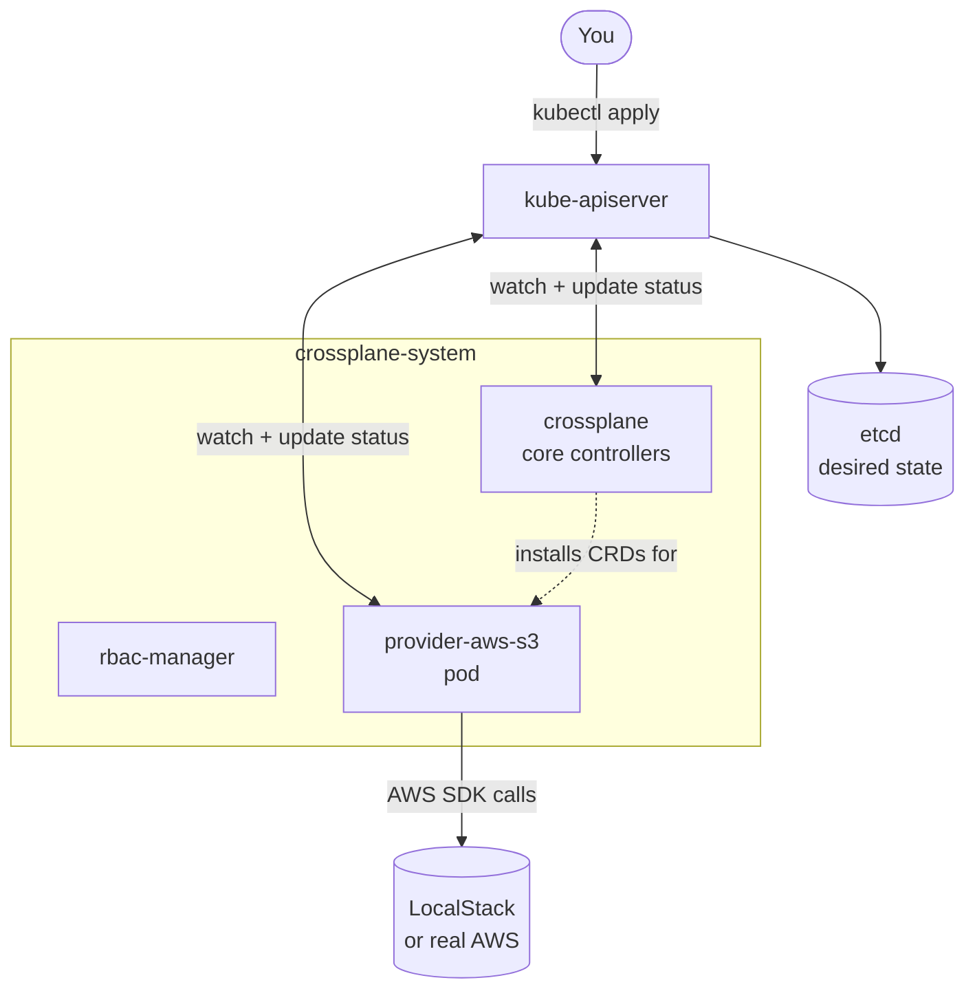

# Module 00 — Setup & Orientation

**Goal:** stand up a real Crossplane v2 control plane on your laptop, with a free
AWS API to point it at, and understand what each moving part does.

⏱️ ~1 hour · 🎯 Prereq: the [Kubernetes course](../../kubernetes-course/) Modules 00–12,
or equivalent comfort with `kubectl`, Deployments, and CRDs.

---

## What we're installing and why

| Tool | What it is | Why we need it |
|------|-----------|----------------|
| **Docker** | Runs containers | kind runs Kubernetes *inside* Docker |
| **kind** | "Kubernetes IN Docker" | A real 3-node cluster, locally, free |
| **kubectl** | The Kubernetes CLI | Crossplane has no CLI of its own for daily work — you use `kubectl` |
| **helm** | Kubernetes package manager | The official way to install Crossplane |
| **crossplane CLI** | Crossplane's own tool | `render`, `validate`, `trace`, and building packages |
| **Crossplane** | The control plane itself | The thing this course is about |
| **LocalStack** | A local emulator of the AWS APIs | Real AWS API calls, zero dollars, no account |

> **Why LocalStack instead of a real AWS account?**
> The Crossplane AWS provider talks to AWS through the ordinary AWS SDK. Every
> request has an *endpoint*, and that endpoint is configurable. Point it at
> LocalStack and the provider genuinely doesn't know the difference — it builds the
> same requests, signs them the same way, and parses the same responses.
>
> That means **every manifest in this course is exactly what you'd apply against a
> real account.** Module 08 shows you the one object you change (a `ProviderConfig`)
> to switch to real AWS, and how to do it safely.
>
> LocalStack's free tier emulates the services we need (S3, EC2/VPC, IAM, STS, RDS,
> DynamoDB) faithfully enough to teach every concept. Where its behaviour differs
> from real AWS in a way that matters, the labs say so explicitly.

---

## Step 1 — Install the CLI tools

```bash
brew install kind kubectl helm crossplane
```

On Linux, or if you'd rather not use Homebrew for the Crossplane CLI:

```bash
curl -sL https://raw.githubusercontent.com/crossplane/crossplane/main/install.sh | sh
sudo mv crossplane /usr/local/bin/
```

Verify:
```bash
kind version
kubectl version --client
helm version
crossplane version --client
```
✅ Expected: each prints a version. The Crossplane CLI should report **v2.x**.

> **Give Docker enough headroom.** Docker Desktop → Settings → Resources:
> **CPUs ≥ 4**, **Memory ≥ 8 GB**. Crossplane + a provider + LocalStack is a
> heavier footprint than the Kubernetes course used. If pods start getting
> `OOMKilled` or evicted later, this is the first thing to check.

## Step 2 — Create the cluster

```bash
cd crossplane-course/00-setup
./scripts/create-cluster.sh
```
✅ Expected: 3 nodes, all `Ready`:
```
NAME                      STATUS   ROLES           AGE   VERSION
xp-course-control-plane   Ready    control-plane   1m    v1.31.x
xp-course-worker          Ready    <none>          1m    v1.31.x
xp-course-worker2         Ready    <none>          1m    v1.31.x
```

## Step 3 — Install Crossplane

```bash
./scripts/install-crossplane.sh
```

This runs, in essence:
```bash
helm repo add crossplane-stable https://charts.crossplane.io/stable
helm install crossplane crossplane-stable/crossplane \
  --namespace crossplane-system --create-namespace --version 2.3.0
```

✅ Expected: two pods `Running` in `crossplane-system`:
```
NAME                                     READY   STATUS    RESTARTS   AGE
crossplane-7d9f8b9c4d-x2k9p              1/1     Running   0          45s
crossplane-rbac-manager-6b8f7d4c9-mn4tz  1/1     Running   0          45s
```

**That's the whole control plane.** Two Deployments. Everything else you install from
here — providers, functions, your own APIs — arrives as Kubernetes objects that these
pods reconcile.

## Step 4 — Install LocalStack

```bash
./scripts/install-localstack.sh
```
✅ Expected: `deployment.apps/localstack condition met`, and a Service on port 4566.

The first run pulls a ~1 GB image, so give it a few minutes.

## Step 5 — Verify everything

```bash
./scripts/verify-setup.sh
```
✅ Expected: all green, ending with `🎉 All green.`

Then run the fuller smoke test in [../VERIFY.md](../VERIFY.md), which actually
provisions an S3 bucket end to end. **Do not skip it** — it proves the provider can
reach LocalStack, which is the single most common thing to have subtly wrong.

---

## Orientation: what did I just install?

Crossplane extends the Kubernetes API so that **cloud resources become Kubernetes
objects**. Nothing more exotic than that.



Three ideas, and the whole course is built on them:

1. **A provider is just a controller.** `provider-aws-s3` is a pod that watches for
   `Bucket` objects and calls the S3 API. It is *exactly* the same pattern as the
   Deployment controller watching for Deployments — you already understand it.

2. **Cloud resources become CRDs.** Installing the S3 provider adds a `Bucket` kind
   to your cluster. `kubectl get buckets` becomes a real command. `kubectl describe`
   works. RBAC applies. Your existing tooling just works.

3. **Reconciliation never stops.** Unlike `terraform apply`, which runs once and
   exits, these controllers loop forever. Delete a bucket in the AWS console and
   Crossplane puts it back — typically within a minute. You'll watch this happen in
   Module 03.

---

## The vocabulary you need before Module 01

You'll meet all of these properly later. For now, just know the shape:

| Term | One-line meaning |
|------|------------------|
| **Provider** | A package that teaches Crossplane to manage one cloud's resources |
| **Managed Resource (MR)** | One cloud resource as a Kubernetes object (`Bucket`, `VPC`, `Instance`) |
| **ProviderConfig** | *How* to authenticate — credentials and endpoint for a provider |
| **XRD** | The API *you* design (`CompositeResourceDefinition`) |
| **Composition** | The implementation of that API — what resources it creates |
| **XR** | An instance of your API (`CompositeResource`) |
| **Function** | A pluggable program that decides what a Composition produces |

Full definitions in [../GLOSSARY.md](../GLOSSARY.md).

---

## Daily workflow

```bash
00-setup/scripts/create-cluster.sh      # start of session
00-setup/scripts/install-crossplane.sh  # (idempotent — safe to re-run)
00-setup/scripts/install-localstack.sh
00-setup/scripts/delete-cluster.sh      # end of session — frees your RAM
```

Rebuilding from scratch takes ~5 minutes. Because everything is declarative YAML
committed to git, **your cluster is disposable** — that's the point of the model
you're about to learn. When a lab goes badly wrong, deleting the cluster is a
legitimate and fast fix.

---

## Troubleshooting setup

- **`docker: Cannot connect to the Docker daemon`** → Docker isn't running. Start it.
- **kind create hangs, or nodes never go `Ready`** → almost always Docker memory.
  Raise it to 8 GB and re-run `./scripts/delete-cluster.sh && ./scripts/create-cluster.sh`.
- **Crossplane pods `CrashLoopBackOff`** → check `kubectl logs -n crossplane-system deploy/crossplane`.
  On a fresh cluster this is nearly always resource pressure.
- **LocalStack stuck `0/1 Running`** → it's still pulling or still booting its
  services. `kubectl logs -n localstack deploy/localstack` shows a `Ready.` line when
  it's finished. The readiness probe allows ~2.5 minutes; a slow connection may need
  a second attempt.
- **`crossplane: command not found`** → the install script drops the binary in your
  current directory; move it onto your `PATH` (`sudo mv crossplane /usr/local/bin/`).
- **`kubectl` points at the wrong cluster** → `kubectl config use-context kind-xp-course`.

More in [../cheatsheets/troubleshooting.md](../cheatsheets/troubleshooting.md).

---

**Next →** [Module 01: Control-Plane Thinking](../01-control-plane-thinking/)
