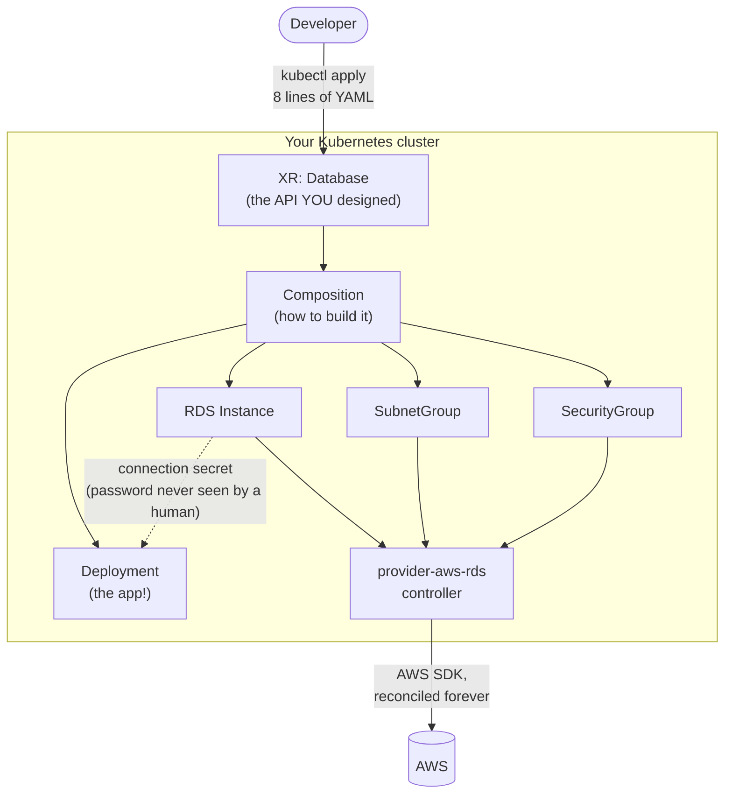

# Module 01 — Control-Plane Thinking

**Goal:** understand *why* Crossplane exists, so that every design decision in the
next 14 modules makes sense instead of feeling arbitrary.

⏱️ ~1.5 hours · 🎯 Prereq: Module 00 complete, `VERIFY.md` all green.

---

## 1. The problem, stated honestly

Here's a workflow you have probably lived:

1. A developer needs a Postgres database for their new service.
2. They file a ticket.
3. A platform engineer writes ~60 lines of Terraform: an RDS instance, a subnet
   group, a security group, a parameter group.
4. CI runs `terraform plan`, someone approves, `terraform apply` runs.
5. The password lands in the Terraform state file. Someone copies it — by hand —
   into a Kubernetes Secret.
6. The developer writes a Helm values file pointing at the new endpoint.
7. Three weeks later someone changes the security group in the AWS console to debug
   something at 2 a.m. Nobody reverts it.
8. Two months later, `terraform plan` shows a diff nobody understands, and everyone
   is afraid to apply it.

Every step here is normal. Every step is also a **seam** — a place where two systems
that don't know about each other are joined by a human, a ticket, or a pipeline.
Seams are where outages come from.

## 2. Two different shapes of automation

The deepest idea in this course is the difference between a **provisioning tool** and
a **control plane**.

### A provisioning tool runs once

```
   you run it          it exits
       │                   │
       ▼                   ▼
   ┌───────┐   API calls   ┌───────┐
   │ CLI   │──────────────►│ Cloud │
   └───────┘               └───────┘
       │
   state file  ← a snapshot of what it believed at the moment it exited
```

Terraform, Pulumi, CloudFormation, and `ansible-playbook` all work this way. They
are **excellent** at what they do. But note what's true between runs: *nothing is
watching.* If reality changes, the tool doesn't know and can't care. It finds out
next time a human runs it.

### A control plane never stops running

```
   ┌──────────────────────────────────────────┐
   │                                          │
   ▼                                          │
observe reality ──► compare to desired ──► act on the difference
   ▲                                          │
   └──────────────────────────────────────────┘
              forever, every ~60 seconds
```

This is the loop you already know from Kubernetes. You declare `replicas: 3`; if a
node dies, you don't run anything — the Deployment controller notices and fixes it.

**Crossplane's entire premise is: apply that same loop to cloud infrastructure.**

### The consequences

| | Provisioning tool | Control plane |
|---|---|---|
| **Runs** | When triggered | Continuously |
| **Drift** | Detected on next run, if someone runs it | Corrected automatically, usually within a minute |
| **State** | A file you must store, lock, and protect | The cluster's etcd + the cloud itself |
| **Who can use it** | Whoever has pipeline access | Anyone with RBAC to create the object |
| **Self-service** | A ticket and a review | `kubectl apply` |
| **Failure mode** | A diff nobody dares apply | A resource stuck `Synced=False` with an error message |
| **Composability** | Modules, at authoring time | APIs, at runtime |

> **This is not a claim that Crossplane is better than Terraform.** It's a claim that
> they are different tools. Module 01's challenge asks you to argue *both* sides,
> because a platform engineer who can't say when Terraform is the right answer isn't
> ready to choose Crossplane either.

## 3. Where Crossplane genuinely wins

**Self-service without tickets.** Once you define an API (Module 04), a developer
gets a database by applying 8 lines of YAML into their own namespace. No pipeline
access, no approval, no platform engineer. RBAC is the guardrail.

**Drift correction, not drift detection.** Someone deletes the bucket in the console;
Crossplane recreates it. You'll watch this happen in Module 03 and it's genuinely
startling the first time.

**One system for apps and infrastructure.** This is the v2 headline. A single
composite resource can create an RDS instance *and* the Deployment that connects to
it, wiring the generated password straight into the Pod's environment. No human ever
sees the password. No seam.

**Everything Kubernetes already gives you, for free.** RBAC, admission control,
audit logs, `kubectl`, Argo CD, Prometheus, finalizers, owner references, events.
You don't build any of it; making cloud resources into Kubernetes objects means all
of it just applies.

## 4. Where Crossplane genuinely loses

Be honest about these — you'll be asked about them in interviews and by skeptical
colleagues:

- **You must run and operate a Kubernetes cluster** to manage infrastructure. If your
  organisation doesn't already run Kubernetes, that's a big prerequisite.
- **No `terraform plan`.** There's no first-class "show me exactly what will change
  before I commit" for a live apply. `crossplane render` (Module 05) previews what a
  composition *produces*, and diff tooling exists, but it isn't Terraform's plan.
- **Provider coverage varies.** Terraform's provider ecosystem is older and broader.
  Most Crossplane AWS providers are generated *from* the Terraform provider (via
  Upjet), so coverage is good — but not universal.
- **Composition is a real skill.** Writing a good XRD/Composition is harder than
  writing a Terraform module. This course exists because it's a skill worth learning,
  not because it's easy.
- **A bad composition can destroy things fast.** A control plane acts without waiting
  for a human. Module 11 and 13 are about the safety mechanisms, and they are not
  optional reading.

## 5. The mental model to carry forward



Read that diagram in two directions:

- **Left to right** is the developer's experience: apply a small object, get a working
  system.
- **Bottom up** is the platform engineer's job: make the boring, correct, secure thing
  the easy thing.

Everything else in this course is detail underneath this picture.

## 6. Vocabulary check

You met these in Module 00. Now they should mean something:

- **Managed Resource** — one cloud resource as a Kubernetes object. *The atoms.*
- **Composition** — a recipe combining several into something useful. *The molecules.*
- **XRD** — the API you offer developers. *The label on the bottle.*
- **XR** — one instance a developer created. *The thing in their hand.*

---

## Do the lab
You'll provision an S3 bucket three ways — by hand with the AWS CLI, then through
Crossplane — and then break both to see how differently they respond.
👉 **[lab.md](./lab.md)**

Then: 👉 **[challenge.md](./challenge.md)**

## Key terms
control plane · reconciliation · drift · declarative · desired state · provisioning
tool · self-service · platform API

**Next →** [Module 02: Providers & Managed Resources](../02-providers-and-managed-resources/)
