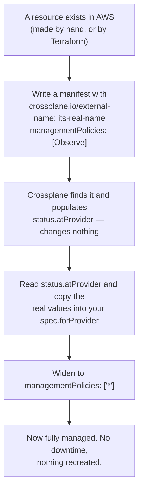

# Module 03 — Managed Resource Lifecycle

**Goal:** control *how much authority* Crossplane has over each resource — so you can
adopt existing infrastructure safely, protect what must never be deleted, and stop a
runaway reconcile without losing anything.

⏱️ ~2.5 hours · 🎯 Prereq: Module 02.

---

## 1. Why this module exists

Module 01 showed drift correction as a feature. Now consider the same behaviour from
a different angle:

> Your company has a production database that was created by hand in 2019. You want
> it in Crossplane. You write a manifest, apply it — and Crossplane creates a *second*
> database, because it had no idea the first one existed.

Or worse:

> A colleague removes a resource from a git repo. Crossplane, faithfully reconciling,
> deletes the production S3 bucket it referred to.

Both are correct behaviour from a system doing exactly what it was told. The
difference between a useful control plane and a dangerous one is **how carefully you
scope its authority**. That scoping is what this module teaches.

## 2. The four levers

| Lever | Controls | Default |
|-------|----------|---------|
| `managementPolicies` | Which *verbs* Crossplane may use | `["*"]` — all of them |
| `deletionPolicy` | What happens in the cloud when you delete the object | `Delete` |
| `crossplane.io/external-name` | *Which* cloud resource this object refers to | auto-generated |
| `crossplane.io/paused` | Whether to reconcile at all | not set (reconciling) |

Everything in this module is a combination of these four.

## 3. managementPolicies — scoping authority

A managed resource's `managementPolicies` lists the actions Crossplane is permitted
to take:

```yaml
spec:
  managementPolicies: ["Observe", "Create", "Update", "Delete", "LateInitialize"]
  # or simply:
  managementPolicies: ["*"]
```

| Verb | Meaning | Remove it to… |
|------|---------|---------------|
| `Observe` | Read the resource's current state | (never remove — everything needs this) |
| `Create` | Create it if missing | Adopt only pre-existing resources |
| `Update` | Push spec changes to the cloud | Make it read-only |
| `Delete` | Destroy it when the object is deleted | Protect it from deletion |
| `LateInitialize` | Write cloud defaults back into your spec | Keep your spec exactly as written |

### The four combinations worth memorising

```yaml
managementPolicies: ["*"]                      # full control — the default
managementPolicies: ["Observe"]                # read-only: watch, never touch
managementPolicies: ["Observe", "Create", "Update"]   # manage, but never delete
managementPolicies: ["Observe", "Create", "Update", "Delete"]  # all but LateInitialize
```

**`["Observe"]` is the one to reach for first when adopting unknown infrastructure.**
It gives you a Kubernetes object reflecting a real resource, with zero risk: Crossplane
reads it, populates `status.atProvider`, and does nothing else. You can inspect what
you've got before granting more authority.

## 4. deletionPolicy — what happens on delete

```yaml
spec:
  deletionPolicy: Delete    # default: destroy the cloud resource too
  # or
  deletionPolicy: Orphan    # leave the cloud resource running
```

`Orphan` means "forget about it, don't destroy it." The cloud resource keeps running,
unmanaged.

> **`deletionPolicy` and `managementPolicies` overlap, and that's confusing.**
> Removing `Delete` from `managementPolicies` and setting `deletionPolicy: Orphan`
> both prevent deletion. The difference:
> - `deletionPolicy: Orphan` — a *deletion-time* decision. Everything else works
>   normally; only deletion is changed.
> - `managementPolicies` without `Delete` — a *permanent* scoping of authority.
>
> `managementPolicies` is the newer, more general mechanism and it wins where they
> conflict. Use `deletionPolicy: Orphan` for the common "protect this one thing" case;
> use `managementPolicies` when you want a broader read-only or no-delete posture.

## 5. Importing existing infrastructure

This is the workflow that makes Crossplane adoptable in a company that already has
infrastructure. It hinges entirely on the external-name annotation.



The critical insight: **`Observe` first.** If you jump straight to `["*"]` with a spec
that doesn't match reality, Crossplane's first act is to "correct" the live resource
to match your (wrong) declaration. On a database, that can mean an instance resize or
a destructive parameter change during business hours.

Observe-first turns a risky operation into a boring one.

## 6. Late initialization, and when to turn it off

By default Crossplane copies cloud-chosen defaults into your `spec.forProvider`
(Module 02, §7). Usually helpful. Two cases where you don't want it:

- **Your manifests live in git and you diff them.** Late initialization makes the live
  object diverge from the file, producing permanent noise.
- **You want your spec to be the exact, minimal statement of intent.**

Turn it off by listing verbs without `LateInitialize`:
```yaml
managementPolicies: ["Observe", "Create", "Update", "Delete"]
```

## 7. Pausing — the emergency brake

```bash
kubectl annotate bucket my-bucket crossplane.io/paused=true
```

Reconciliation stops for that one resource. Nothing is deleted; nothing is changed;
Crossplane simply looks away.

Use it when:
- You need to make a manual change in the console without Crossplane reverting it.
- A composition is doing something wrong and you need it to *stop* while you think.
- You're debugging and want a stable object to inspect.

Remove it with a trailing dash: `kubectl annotate bucket my-bucket crossplane.io/paused-`

> **Pausing is not protection.** A paused resource still gets deleted if you
> `kubectl delete` it (subject to `deletionPolicy`). Pause stops the *loop*, not the
> *lifecycle*.

## 8. Deletion ordering and finalizers

Every managed resource carries a **finalizer**. When you delete the object, Kubernetes
marks it `Terminating` and waits; Crossplane deletes the cloud resource, then removes
the finalizer, and only then does the object disappear.

This is why deletion can hang. If the cloud refuses (`BucketNotEmpty`,
`DependencyViolation`), the finalizer stays and the object sits in `Terminating`
forever — which is *correct*: it's telling you the real world isn't in the state you
requested.

Read the error, fix the real cause. Force-removing a finalizer orphans the cloud
resource silently and should be your last resort:
```bash
kubectl patch bucket my-bucket --type=merge -p '{"metadata":{"finalizers":[]}}'
```

## 9. A decision table

| Situation | Configuration |
|-----------|--------------|
| Ordinary app resource, disposable | `managementPolicies: ["*"]`, `deletionPolicy: Delete` |
| Production database | `deletionPolicy: Orphan` |
| Auditing infra you don't own | `managementPolicies: ["Observe"]` |
| Mid-import, verifying first | `["Observe"]` → widen once the spec matches |
| Managed by another team's Terraform | `managementPolicies: ["Observe"]` |
| Debugging a misbehaving resource | `crossplane.io/paused=true` |
| Spec must match git exactly | omit `LateInitialize` |

---

## Do the lab
Import a hand-built bucket without recreating it, protect a resource from deletion,
scope a resource to read-only, and get a deletion deliberately stuck — then unstick it.
👉 **[lab.md](./lab.md)**

Then: 👉 **[challenge.md](./challenge.md)**

## Manifests
- [`observe-only.yaml`](./manifests/observe-only.yaml) — import an existing bucket read-only
- [`imported-full.yaml`](./manifests/imported-full.yaml) — the same bucket, fully managed
- [`orphan-on-delete.yaml`](./manifests/orphan-on-delete.yaml) — survives object deletion
- [`no-late-init.yaml`](./manifests/no-late-init.yaml) — spec stays exactly as written

## Key terms
`managementPolicies` · `deletionPolicy` · Orphan · import/adoption · external name ·
late initialization · pause · finalizer

**Next →** [Module 04: XRDs & Compositions](../04-xrds-and-compositions/)
