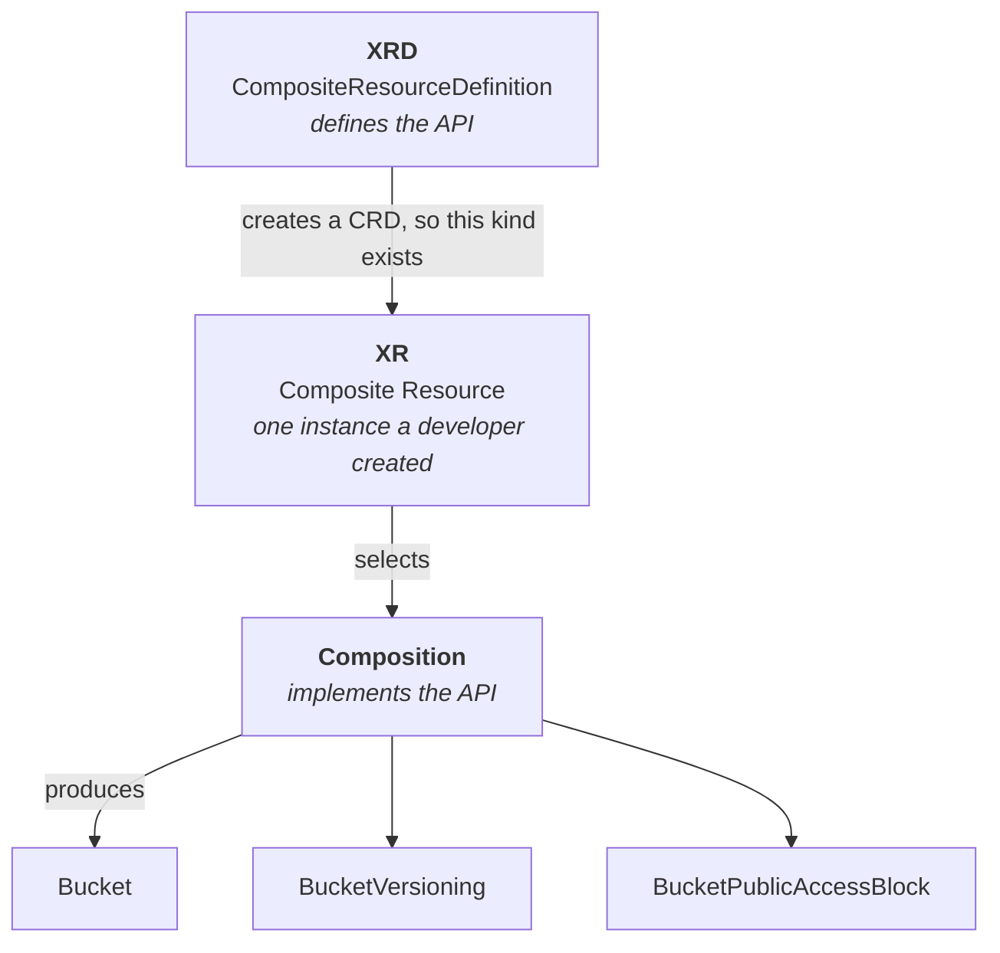

# Module 04 — XRDs & Compositions

**Goal:** stop consuming other people's APIs and start designing your own. This is the
module where Crossplane becomes a platform tool rather than a provisioning tool.

⏱️ ~3 hours · 🎯 Prereq: Modules 02–03.

---

## 1. The problem with managed resources

In Module 02 you created a "production-shaped" bucket. It took **four managed
resources**: the bucket, versioning, encryption, and a public access block. About 60
lines of YAML, and you needed to know that S3 splits its configuration this way.

Now imagine telling a product engineer: "to get a bucket, write these 60 lines, and
don't forget the public access block or we fail our audit."

They won't. They'll forget it, or copy a stale example, or file a ticket. Managed
resources are the right *primitive* and the wrong *interface*.

**What you want to offer instead:**

```yaml
apiVersion: platform.acme.io/v1alpha1
kind: Bucket
metadata:
  name: user-uploads
  namespace: team-payments
spec:
  environment: prod
  retentionDays: 90
```

Six lines. No AWS knowledge. Impossible to forget the security settings, because the
platform adds them. **That's a platform API, and this module builds one.**

## 2. The three objects



| Object | Analogy | Who writes it |
|--------|---------|---------------|
| **XRD** | An interface / a class declaration | Platform team |
| **Composition** | The implementation | Platform team |
| **XR** | An object you instantiated | Developer |

One XRD can have **many** Compositions — the same `Bucket` API implemented
differently for dev and prod, or for AWS and GCP. The developer's YAML doesn't change.

## 3. The XRD — defining your API

```yaml
apiVersion: apiextensions.crossplane.io/v2
kind: CompositeResourceDefinition
metadata:
  # MUST be <plural>.<group>
  name: xbuckets.platform.acme.io
spec:
  # Namespaced is the v2 default: XRs live in a namespace, like Deployments.
  scope: Namespaced
  group: platform.acme.io
  names:
    kind: XBucket
    plural: xbuckets
  versions:
    - name: v1alpha1
      served: true
      referenceable: true
      schema:
        openAPIV3Schema:
          type: object
          properties:
            spec:
              type: object
              properties:
                environment:
                  type: string
                  enum: [dev, staging, prod]
                retentionDays:
                  type: integer
                  default: 30
                  minimum: 1
                  maximum: 3650
              required: [environment]
            status:
              type: object
              properties:
                bucketArn:
                  type: string
```

Three things to notice:

**`scope: Namespaced`** — the v2 default and almost always what you want. XRs live in
namespaces, so RBAC, quotas, and namespace isolation all apply naturally. (See §7 for
the other scopes and why claims are gone.)

**The schema is standard OpenAPI v3**, exactly as in any CRD. `enum`, `default`,
`minimum`, `pattern`, and `required` all work — and **they are your first line of
defence**. A field constrained to `[dev, staging, prod]` cannot receive a typo. Use
this aggressively; validation you push into the schema is validation you never have
to write in a function.

**`status`** is where you surface results back to the user — the ARN, the endpoint,
whatever they need. The composition writes it.

## 4. The Composition — implementing your API

```yaml
apiVersion: apiextensions.crossplane.io/v1
kind: Composition
metadata:
  name: xbucket-aws
spec:
  compositeTypeRef:                       # ← MUST match the XRD exactly
    apiVersion: platform.acme.io/v1alpha1
    kind: XBucket
  mode: Pipeline
  pipeline:
    - step: render
      functionRef:
        name: function-patch-and-transform
      input:
        apiVersion: pt.fn.crossplane.io/v1beta1
        kind: Resources
        resources:
          - name: bucket
            base:
              apiVersion: s3.aws.upbound.io/v1beta1
              kind: Bucket
              spec:
                forProvider:
                  region: us-east-1
            patches:
              - type: FromCompositeFieldPath
                fromFieldPath: spec.environment
                toFieldPath: spec.forProvider.tags.environment
    - step: ready
      functionRef:
        name: function-auto-ready
```

**`compositeTypeRef` must match the XRD's group, version, and kind exactly.** A
mismatch here is the single most common beginner error, and its symptom is an XR that
sits doing nothing with no obvious error. Check it first, every time.

**`mode: Pipeline` is the only mode.** Crossplane v1 let you list `resources` directly
on the Composition. v2 removed that — everything goes through functions now. If you
find a tutorial with `spec.resources` and no `pipeline`, it predates v2.

## 5. The XR — what a developer writes

```yaml
apiVersion: platform.acme.io/v1alpha1
kind: XBucket
metadata:
  name: user-uploads
  namespace: team-payments
spec:
  environment: prod
  retentionDays: 90
```

Crossplane's own machinery lives under **`spec.crossplane`**, kept separate from your
API's fields:

```yaml
spec:
  environment: prod              # ← your API
  crossplane:                    # ← Crossplane's machinery
    compositionRef:
      name: xbucket-aws
    compositionUpdatePolicy: Manual
```

That separation is a v2 improvement: in v1 these fields sat at the top level of
`spec`, colliding with the API designer's namespace.

## 6. How a Composition gets selected

When an XR appears, Crossplane must pick a Composition. In order:

1. **`spec.crossplane.compositionRef.name`** — explicit. Wins.
2. **`spec.crossplane.compositionSelector.matchLabels`** — pick by label.
3. **The XRD's `defaultCompositionRef`** — a fallback.
4. **Exactly one Composition matches the type** — used automatically.

If several match and none is specified, you get `CompositionSelectionFailed` and
nothing happens. Label-based selection is the idiomatic way to offer variants:

```yaml
# Composition
metadata:
  labels: { provider: aws, tier: production }

# XR
spec:
  crossplane:
    compositionSelector:
      matchLabels: { tier: production }
```

## 7. Scopes, and where claims went

| Scope | XR lives | Can compose | Claims? |
|-------|----------|-------------|---------|
| `Namespaced` | in a namespace | resources in that namespace | No |
| `Cluster` | cluster-wide | anywhere | No |
| `LegacyCluster` | cluster-wide | cluster resources | **Yes** (v1 compat) |

In Crossplane v1, XRs were always cluster-scoped, so a **Claim** existed as a
namespaced front-end for developers: you'd define `XPostgreSQLInstance` (cluster) and
developers created `PostgreSQLInstance` (namespaced). Two kinds for one concept.

**v2 made XRs themselves namespaced, so claims are unnecessary and unsupported** in
`Namespaced` and `Cluster` scopes. `LegacyCluster` exists only to keep v1
configurations running.

> This matters because most Crossplane content online was written for v1. If you see
> `claimNames` in an XRD, or an example creating a `PostgreSQLInstance` alongside an
> `XPostgreSQLInstance`, you're reading pre-v2 material. Use `scope: Namespaced` and
> a single kind.

**Naming convention:** the `X` prefix (`XBucket`) is a v1 habit that distinguished
composites from claims. With claims gone it's optional. This course keeps it because
it makes examples unambiguous, but naming your kind plain `Bucket` in the
`platform.acme.io` group is perfectly good v2 style.

## 8. Designing a good API

The technical part is easy. Designing an API developers actually want is the skill.

**Expose intent, not implementation.**
```yaml
size: small           # ✅ they know what they need
instanceClass: db.t3.micro   # ❌ they'd have to research this
```

**Constrain hard.** Every option is a support burden and a way to misconfigure
something. Start with `enum` and three values. Adding an option later is easy;
removing one breaks users.

**Default the boring things.** Encryption, backups, tagging, access blocking — the
developer should not be able to omit them, so don't make them fields at all.

**Surface what they need back.** If they need the bucket's real name to configure
their app, put it in `status`. Making them run `kubectl get bucket` to find it defeats
the abstraction.

**Design for the 80% case.** If a team genuinely needs something exotic, let them use
managed resources directly. An API trying to cover everything is worse than one that
covers most things well.

---

## Do the lab
Build a complete platform API — XRD, Composition, XR — with four managed resources
hidden behind six lines of developer YAML. Then break the `compositeTypeRef` on
purpose to learn its failure signature.
👉 **[lab.md](./lab.md)**

Then: 👉 **[challenge.md](./challenge.md)**

## Manifests
- [`xrd.yaml`](./manifests/xrd.yaml) — the `XBucket` API definition
- [`composition.yaml`](./manifests/composition.yaml) — its AWS implementation
- [`functions.yaml`](./manifests/functions.yaml) — the functions the pipeline uses
- [`xr-dev.yaml`](./manifests/xr-dev.yaml) / [`xr-prod.yaml`](./manifests/xr-prod.yaml) — instances
- [`composition-cheap.yaml`](./manifests/composition-cheap.yaml) — a second implementation

## Key terms
XRD · Composition · XR · `compositeTypeRef` · `mode: Pipeline` · scope · Namespaced ·
`spec.crossplane` · composition selection · claim (v1 only) · OpenAPI schema

**Next →** [Module 05: Composition Functions](../05-composition-functions/)
