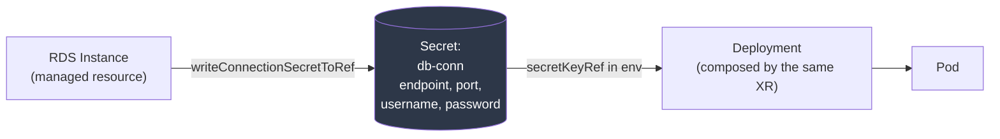

# Module 06 — Composing Applications *and* Infrastructure

**Goal:** create a database and the Deployment that uses it from a single composite
resource, with the generated password wired in automatically and no human in the loop.

⏱️ ~3 hours · 🎯 Prereq: Modules 04–05.

---

## 1. The seam, one last time

Module 01 described a workflow with a seam in the middle:

> Terraform provisions the database → the password lands in state → **a human copies
> it into a Kubernetes Secret** → Helm deploys the app pointing at it.

Every mitigation for that step is a workaround: External Secrets Operator syncing
from Secrets Manager, a Terraform provider that writes Kubernetes Secrets, a CI job
that shuttles values between systems. They work. They're also three more systems to
run, monitor, and debug.

**Crossplane v2's answer is to delete the seam rather than automate it.** One XR
creates the RDS instance *and* the Deployment, and passes the connection details
between them internally. Nothing crosses a system boundary, so nothing can be dropped.

## 2. What changed in v2

In Crossplane v1, a Composition could only compose **managed resources** — things a
provider owned. Composing a Deployment meant installing `provider-kubernetes` and
wrapping your Deployment inside an `Object` resource:

```yaml
# The v1 way — a Deployment smuggled inside a provider resource
apiVersion: kubernetes.crossplane.io/v1alpha2
kind: Object
spec:
  forProvider:
    manifest:
      apiVersion: apps/v1
      kind: Deployment      # your actual Deployment, two levels down
```

It worked, but the nesting was awkward, and RBAC and status reporting were indirect.

**In v2, a namespaced XR can compose any Kubernetes resource in its namespace,
directly:**

```yaml
# The v2 way — just a Deployment
- name: app
  base:
    apiVersion: apps/v1
    kind: Deployment
    spec: { ... }
```

No wrapper. No extra provider. The XR owns the Deployment the same way it owns a
Bucket.

> This is the single biggest reason to be on v2, and the reason this course exists in
> its current shape. It turns Crossplane from "Terraform, but Kubernetes-flavoured"
> into something with no real equivalent: one API surface for the whole stack.

## 3. Connection details — the mechanism

The plumbing that makes this work is the **connection secret**.



1. A managed resource that produces credentials writes them to a Secret:
   ```yaml
   spec:
     writeConnectionSecretToRef:
       namespace: team-payments
       name: db-conn
   ```
2. The composition creates a Deployment referencing that Secret:
   ```yaml
   env:
     - name: DB_PASSWORD
       valueFrom:
         secretKeyRef: { name: db-conn, key: password }
   ```

The password is generated by AWS (or by the provider), written into etcd, and read by
the kubelet when the Pod starts. **It never appears in a git repo, a CI log, a
Terraform state file, or a human's clipboard.**

### Standard connection secret keys

| Resource | Keys it writes |
|----------|---------------|
| RDS `Instance` | `endpoint`, `port`, `username`, `password`, `attribute.address` |
| ElastiCache | `endpoint`, `port` |
| Any XR | Whatever its composition declares |

Check what a resource actually produced:
```bash
kubectl get secret db-conn -o jsonpath='{.data}' | jq 'keys'
```

## 4. Ordering: the app must wait for the database

Composed resources are created **in parallel**. Your Deployment will be created at the
same instant as the RDS instance — and RDS takes 5–15 minutes on real AWS.

You have three options, and they suit different situations:

**a) Let it crash-loop (often correct).** Kubernetes will restart the Pod until the
database answers. It's ugly in the logs but self-healing, and it's how most
well-written applications behave anyway.

**b) An init container that waits.** Explicit, readable, and keeps the app's own logs
clean:
```yaml
initContainers:
  - name: wait-for-db
    image: busybox:1.36
    command: ['sh','-c','until nc -z $DB_HOST 5432; do sleep 2; done']
```

**c) `function-sequencer`.** Genuinely delays creating the Deployment until the
database is ready:
```yaml
- step: sequence
  functionRef: { name: function-sequencer }
  input:
    apiVersion: sequencer.fn.crossplane.io/v1beta1
    kind: Input
    rules:
      - sequence: [database, app]
```

> **Prefer (a) or (b).** Sequencing makes your composition slower and more fragile —
> if the database never becomes ready, the app is never even *created*, so you can't
> inspect it to find out why. A crash-looping Pod with a clear error is easier to
> debug than a Pod that doesn't exist. Reach for (c) only when a cloud API genuinely
> rejects out-of-order creation.

## 5. Namespaced XRs compose namespaced resources

With `scope: Namespaced`, an XR composes resources **in its own namespace**. That's a
security property, not just a convenience:

- A developer with access only to `team-payments` creates an XR there, and everything
  it produces lands there.
- Standard namespace RBAC, quotas, and NetworkPolicies apply to the composed
  Deployment automatically.
- One team's XR cannot create a Deployment in another team's namespace.

Managed resources are a nuance: cloud resources aren't really "in" a namespace. In v2
a namespaced XR can compose them, and they're tracked against that namespace, but the
*cloud* resource is account-wide. Namespace isolation controls **who can ask**, not
what AWS itself enforces — for that you need per-namespace ProviderConfigs and IAM
boundaries (Module 13).

## 6. What belongs in one XR?

The power to compose anything invites over-composition. A useful test:

**Do these things share a lifecycle?** If deleting one should delete the other, they
belong together. A service and its database: usually yes. A service and the shared
VPC it runs in: definitely not — the VPC outlives every service in it.

**Good XR boundaries:**
- ✅ An app + its private database + its bucket + its IAM role
- ✅ A data pipeline + its queues + its processing Deployment
- ❌ Everything a team owns, in one XR
- ❌ The VPC + every app inside it

**A useful heuristic:** an XR should be something a developer would name. "The
payments service" is a thing. "The payments service and also the shared network and
also the monitoring stack" is a bundle.

When two XRs need to relate, compose one from the other (an XR can compose another
XR) or reference shared infrastructure through an EnvironmentConfig (Module 10).

---

## Do the lab
Build `XWebApp` — a database, a bucket, an IAM-less app Deployment, a Service, and an
Ingress, from one 8-line resource. Then prove the password was never visible.
👉 **[lab.md](./lab.md)**

Then: 👉 **[challenge.md](./challenge.md)**

## Manifests
- [`xrd.yaml`](./manifests/xrd.yaml) — the `XWebApp` API
- [`composition.yaml`](./manifests/composition.yaml) — database + bucket + app + service + ingress
- [`functions.yaml`](./manifests/functions.yaml) — adds `function-sequencer`
- [`xr-app.yaml`](./manifests/xr-app.yaml) — a developer's 8 lines
- [`app/`](./manifests/app/) — the sample application this composition deploys

## Key terms
connection details · connection secret · `writeConnectionSecretToRef` ·
composing Kubernetes resources · `function-sequencer` · lifecycle boundary ·
namespaced composition

**Next →** [Module 07: AWS Networking](../07-aws-networking/)
