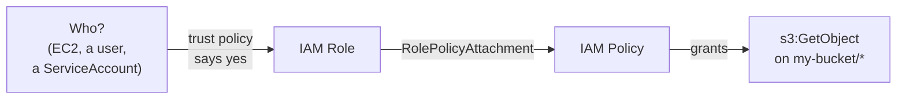
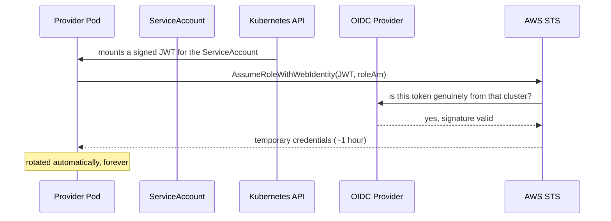

# Module 08 — AWS IAM & Identity

**Goal:** write least-privilege IAM with Crossplane, and authenticate your control
plane to real AWS without storing a single long-lived key.

⏱️ ~3 hours · 🎯 Prereq: Modules 06–07.

---

> ⚠️ **Read this before the lab.** The local emulator **accepts IAM policies without
> evaluating them**. Every policy you write here is syntactically real and correct,
> but a passing lab does *not* prove a policy works. IAM is the one area of this
> course where you must verify against a real account before trusting your work.
> Section 8 tells you how.

## 1. Two kinds of policy, and the mistake everyone makes

IAM has two policy types that look similar and do completely different jobs.

**A trust policy (`assumeRolePolicy`) answers: *who may become this role?***
```json
{
  "Version": "2012-10-17",
  "Statement": [{
    "Effect": "Allow",
    "Principal": { "Service": "ec2.amazonaws.com" },
    "Action": "sts:AssumeRole"
  }]
}
```

**A permission policy answers: *what may this role do?***
```json
{
  "Version": "2012-10-17",
  "Statement": [{
    "Effect": "Allow",
    "Action": ["s3:GetObject"],
    "Resource": "arn:aws:s3:::my-bucket/*"
  }]
}
```

The trust policy lives **on the role** (`spec.forProvider.assumeRolePolicy`). The
permission policy is a **separate `Policy` resource**, joined by a
`RolePolicyAttachment`. Confusing them is the most common IAM error in Crossplane,
and its symptom is baffling: a role that exists, has the right permissions, and that
nothing is allowed to use.



## 2. The Crossplane resources

| Kind | Purpose |
|------|---------|
| `Role` | An assumable identity. Carries the **trust** policy. |
| `Policy` | A standalone permission document. |
| `RolePolicyAttachment` | Joins a `Policy` to a `Role`. |
| `RolePolicy` | An *inline* policy on a role (no separate `Policy` object). |
| `User` / `AccessKey` | Long-lived identities — **avoid** (see §5). |
| `OpenIDConnectProvider` | The trust anchor that makes IRSA possible. |
| `InstanceProfile` | Wraps a role so an EC2 instance can use it. |

Policy documents are **JSON strings**, not YAML structures. Use a block scalar:
```yaml
policy: |
  { "Version": "2012-10-17", "Statement": [ ... ] }
```

## 3. Writing least privilege

Least privilege means: the smallest set of actions, on the narrowest set of
resources, that lets the job get done.

**Two statements, not one.** Object actions and bucket actions target different ARNs,
and this trips up nearly everyone:
```json
{
  "Statement": [
    { "Effect": "Allow",
      "Action": ["s3:GetObject", "s3:PutObject"],
      "Resource": "arn:aws:s3:::my-bucket/*" },
    { "Effect": "Allow",
      "Action": ["s3:ListBucket"],
      "Resource": "arn:aws:s3:::my-bucket" }
  ]
}
```
`s3:ListBucket` on `my-bucket/*` silently grants nothing. The app can read a file it
already knows the name of, and cannot list the bucket — a genuinely confusing failure.

**Never ship these:**
```json
{ "Action": "*", "Resource": "*" }        // administrator
{ "Action": "s3:*", "Resource": "*" }     // every bucket in the account
{ "Action": "iam:*", "Resource": "*" }    // can grant itself anything
```

**Compositions are where least privilege becomes practical.** Hand-writing a scoped
policy per service is tedious, so people write `s3:*` instead. A composition
generates the correct narrow policy every time, from the bucket name it just created —
the secure path becomes the *easy* path, which is the only way least privilege
survives contact with a deadline.

## 4. How your control plane authenticates

Four sources, and the choice matters enormously.

| Source | Use when | Security |
|--------|----------|----------|
| `Secret` | Local dev, emulator | ⚠️ Static, long-lived, sits in etcd |
| `IRSA` | Crossplane runs on EKS | ✅ Best on EKS |
| `WebIdentity` | Any OIDC-capable cluster | ✅ No stored keys |
| `InjectedIdentity` | Node instance profile | ⚠️ Every pod on the node shares it |

```yaml
# This course
spec:
  credentials:
    source: Secret
    secretRef: { namespace: crossplane-system, name: aws-creds, key: creds }

# Production on EKS — no key exists to leak
spec:
  credentials:
    source: IRSA
```

## 5. IRSA — how a pod gets AWS permissions with no key

**IRSA (IAM Roles for Service Accounts)** lets a Kubernetes ServiceAccount assume an
IAM role. This is the mechanism that answers the question Module 06's challenge
raised.



The pieces:

1. **The cluster has an OIDC issuer URL** and AWS is told to trust it via an
   `OpenIDConnectProvider`.
2. **An IAM role's trust policy** accepts tokens from that issuer, for one specific
   ServiceAccount:
   ```json
   {
     "Effect": "Allow",
     "Principal": { "Federated": "arn:aws:iam::123456789012:oidc-provider/oidc.eks.us-east-1.amazonaws.com/id/EXAMPLE" },
     "Action": "sts:AssumeRoleWithWebIdentity",
     "Condition": {
       "StringEquals": {
         "oidc.eks.us-east-1.amazonaws.com/id/EXAMPLE:sub":
           "system:serviceaccount:crossplane-system:provider-aws"
       }
     }
   }
   ```
3. **The ServiceAccount is annotated** with the role's ARN.

> **The `Condition` block is the security.** Without it, *any* ServiceAccount in the
> cluster could assume the role. That `sub` claim pins it to one namespace and one
> ServiceAccount — omitting it is a real and common misconfiguration that turns
> per-workload identity back into cluster-wide identity.

**Why IRSA beats an IAM user:** credentials are short-lived and rotate automatically,
there is no secret to leak, permissions are per-workload rather than per-node, and
CloudTrail shows which ServiceAccount acted.

## 6. Cross-account access

One control plane commonly manages several AWS accounts. Use one `ProviderConfig` per
target account:

```yaml
apiVersion: aws.upbound.io/v1beta1
kind: ProviderConfig
metadata:
  name: prod-account
spec:
  credentials:
    source: IRSA
  assumeRoleChain:
    - roleARN: arn:aws:iam::222222222222:role/CrossplaneProvisioner
```

Crossplane authenticates via IRSA in its own account, then assumes a role in the
target one. The target account's role trusts only the control plane's role.

**This is the strongest isolation boundary available** — far stronger than
namespaces or RBAC, because it's enforced by AWS rather than by your cluster. Module
13 builds multi-tenancy on top of it.

## 7. Permissions boundaries

A **permissions boundary** caps what a role can do, regardless of what its policies
grant. Effective permissions = policies **∩** boundary.

This matters directly for Crossplane: if your platform lets developers create IAM
roles through an XR, a boundary stops them creating one with `AdministratorAccess`.

```yaml
spec:
  forProvider:
    permissionsBoundary: arn:aws:iam::123456789012:policy/DeveloperBoundary
```

Any platform API that provisions IAM roles should set a boundary. Without one,
"create me a role" is effectively "give me any permission in the account."

## 8. Verifying policies for real

Because the emulator doesn't evaluate policies, use these against a real account:

```bash
# Would this action be allowed? (dry-run, no side effects)
aws iam simulate-principal-policy \
  --policy-source-arn arn:aws:iam::123456789012:role/my-role \
  --action-names s3:GetObject \
  --resource-arns arn:aws:s3:::my-bucket/file.txt

# Validate a policy document for syntax and bad practice
aws accessanalyzer validate-policy \
  --policy-document file://policy.json --policy-type IDENTITY_POLICY
```

`validate-policy` runs offline against real AWS grammar and catches over-broad
statements. **Put it in CI** — it's the cheapest possible check on a class of mistake
that is expensive to discover in production.

---

## Do the lab
Build a role with a trust policy and a scoped permission policy, generate
least-privilege policies from a composition, and construct a complete IRSA setup.
👉 **[lab.md](./lab.md)**

Then: 👉 **[challenge.md](./challenge.md)**

## Manifests
- [`role-basic.yaml`](./manifests/role-basic.yaml) — trust policy vs. permission policy
- [`xrd.yaml`](./manifests/xrd.yaml) — an `XAppIdentity` API
- [`composition.yaml`](./manifests/composition.yaml) — generates scoped policies
- [`irsa.yaml`](./manifests/irsa.yaml) — a full IRSA setup, annotated
- [`providerconfig-real-aws.yaml`](./manifests/providerconfig-real-aws.yaml) — the production version

## Key terms
trust policy · `assumeRolePolicy` · permission policy · `RolePolicyAttachment` ·
least privilege · IRSA · OIDC provider · `AssumeRoleWithWebIdentity` · STS ·
`assumeRoleChain` · permissions boundary

**Next →** [Module 09: AWS Data Services](../09-aws-data-services/)
