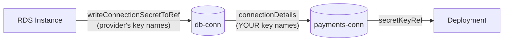

# Module 09 — AWS Data Services & Connection Secrets

**Goal:** provision databases the way a platform should — inside a private network,
with generated credentials that reach the application and never reach a human.

⏱️ ~3 hours · 🎯 Prereq: Modules 06–08.

---

## 1. What makes databases different

An S3 bucket is stateless from your point of view: destroy it and recreate it, and
apart from the objects, nothing was lost. A database is not like that.

Four properties change how you must treat them:

1. **They hold irreplaceable state.** A mistake is not "recreate it"; it's an
   incident.
2. **They produce credentials.** Something must generate a password and get it to the
   application.
3. **They live in a network.** Subnet groups, security groups, and DNS all have to be
   right or nothing connects.
4. **They're slow.** Real RDS takes 5–15 minutes to create and can take longer to
   modify. Your composition must tolerate long `Ready=False` windows.

Every design decision in this module follows from one of those.

## 2. RDS: the resources involved

```yaml
apiVersion: rds.aws.upbound.io/v1beta1
kind: Instance
spec:
  forProvider:
    region: us-east-1
    engine: postgres
    engineVersion: "16.3"
    instanceClass: db.t3.micro
    allocatedStorage: 20
    username: appuser
    autoGeneratePassword: true
    passwordSecretRef:
      namespace: crossplane-system
      name: db-password
      key: password
    dbSubnetGroupNameRef: { name: my-subnet-group }
    vpcSecurityGroupIdRefs: [{ name: my-db-sg }]
    publiclyAccessible: false
    skipFinalSnapshot: true          # false in production
  writeConnectionSecretToRef:
    namespace: team-payments
    name: db-conn
```

| Kind | Purpose |
|------|---------|
| `Instance` | The database itself |
| `SubnetGroup` | Which subnets RDS may place it in — **needs ≥2 AZs** |
| `ParameterGroup` | Engine configuration |
| `Cluster` | Aurora, for multi-writer/reader setups |

> **The single most common RDS composition failure:** a `SubnetGroup` with subnets in
> only one availability zone. AWS requires **at least two**, even for a single-AZ
> instance. This is why Module 07's `XNetwork` defaults `highAvailability` to true.

## 3. The password problem, solved properly

Three ways to give a database a password, from worst to best:

**❌ Hardcode it.**
```yaml
password: hunter2      # now in git, forever, in every clone
```

**⚠️ Reference a Secret you created.** Better — the value isn't in git — but a human
still generated and typed it, so it exists in someone's shell history.

**✅ Let the provider generate it.**
```yaml
autoGeneratePassword: true
passwordSecretRef:
  namespace: crossplane-system
  name: db-password
  key: password
```
The provider generates a random password, writes it to that Secret, and uses it. **No
human ever knows the value.** There is nothing to leak, nothing to rotate manually,
and nothing to accidentally paste into Slack.

## 4. Connection secrets: two levels

There are **two** places connection details flow, and conflating them causes
confusion.

**Level 1 — the managed resource writes what it knows:**
```yaml
kind: Instance
spec:
  writeConnectionSecretToRef:
    namespace: team-payments
    name: db-conn
```
Produces keys: `endpoint`, `port`, `username`, `password`, `attribute.address`.

**Level 2 — the composition surfaces a curated set on the XR.** The XR's own
connection secret can combine values from several composed resources, renamed to
whatever your platform's contract says:

```yaml
- name: database
  base: { ... }
  connectionDetails:
    - type: FromConnectionSecretKey
      name: DATABASE_PASSWORD
      fromConnectionSecretKey: password
    - type: FromFieldPath
      name: DATABASE_HOST
      fromFieldPath: status.atProvider.endpoint
    - type: FromValue
      name: DATABASE_SSLMODE
      value: require
```

**Why bother with level 2?** Because it's your platform's **API contract**. If every
app consumes `DATABASE_URL`, `DATABASE_HOST`, and `DATABASE_PASSWORD`, you can swap
RDS for Aurora, or AWS for GCP, and no application changes. Level 1 leaks the
provider's naming into every consumer.



## 5. Deletion: the settings that decide whether you have a job tomorrow

```yaml
spec:
  forProvider:
    skipFinalSnapshot: false                 # take a snapshot before deleting
    finalSnapshotIdentifier: payments-final
    deletionProtection: true                 # AWS itself refuses to delete
  deletionPolicy: Orphan                     # Crossplane won't even try
```

**Use all three on anything holding real data.** They're independent controls at three
different layers:

- `deletionProtection` — **AWS** refuses. Survives even a deleted control plane.
- `deletionPolicy: Orphan` — **Crossplane** won't issue the delete.
- `skipFinalSnapshot: false` — if deletion does happen, there's a backup.

Every one of these is off or unsafe by default, because AWS optimises defaults for
ephemeral test resources.

> `skipFinalSnapshot: true` throughout this course's manifests is a **lab
> convenience**, and every one of them says so. In production it means deletion
> destroys the data with no recovery.

## 6. DynamoDB, for contrast

```yaml
apiVersion: dynamodb.aws.upbound.io/v1beta1
kind: Table
spec:
  forProvider:
    region: us-east-1
    billingMode: PAY_PER_REQUEST
    hashKey: id
    attribute:
      - name: id
        type: S
```

Simpler in every way: no network, no subnet group, no password, no security group.
Access is entirely via IAM (Module 08), and there's nothing to connect to.

> **Gotcha:** declare only attributes used as **keys** — the table's hash key, range
> key, and any index keys. Declaring every field you plan to store is an error, and
> the message is unhelpful. DynamoDB is schemaless apart from its keys.

## 7. Changes that destroy data

Some fields cannot be changed in place. When you change one, the provider's only
path to convergence is **delete and recreate** — which on a database means total data
loss, executed automatically, within about a minute of your `kubectl apply`.

| Change | Result |
|--------|--------|
| `engine` (postgres → mysql) | **Replace** |
| `dbSubnetGroupName` | **Replace** |
| Reducing `allocatedStorage` | Rejected, then possibly replaced |
| Changing the external name | **Orphans the old, creates new** |
| `instanceClass` | In-place (with downtime) |
| `allocatedStorage` upward | In-place |
| `engineVersion` upward | In-place |

**Protect yourself:**
1. `deletionProtection: true` — AWS blocks the delete half of the replacement.
2. Constrain the XRD schema so replacement-triggering fields aren't settable at all.
3. A CEL validation rule making them immutable after creation:
   ```yaml
   x-kubernetes-validations:
     - rule: "self.engine == oldSelf.engine"
       message: "engine cannot be changed after creation"
   ```

Option 3 is the strongest, because it fails at `kubectl apply` with a clear message
instead of silently doing the right thing according to a wrong declaration.

---

## Do the lab
Provision Postgres inside the Module 07 network, wire its generated credentials into
an app through a curated connection secret, and watch a replacement-triggering change
get rejected.
👉 **[lab.md](./lab.md)**

Then: 👉 **[challenge.md](./challenge.md)**

## Manifests
- [`raw-rds.yaml`](./manifests/raw-rds.yaml) — RDS with a subnet group, by hand
- [`xrd.yaml`](./manifests/xrd.yaml) — the `XDatabase` API, with immutability rules
- [`composition.yaml`](./manifests/composition.yaml) — RDS + curated connection secret
- [`xr-database.yaml`](./manifests/xr-database.yaml) — a developer's request
- [`consumer.yaml`](./manifests/consumer.yaml) — an app consuming the secret

## Key terms
connection secret · `writeConnectionSecretToRef` · `connectionDetails` ·
`autoGeneratePassword` · subnet group · `deletionProtection` · final snapshot ·
replacement · immutable field

**Next →** [Module 10: Reuse & Packaging](../10-reuse-and-packaging/)
