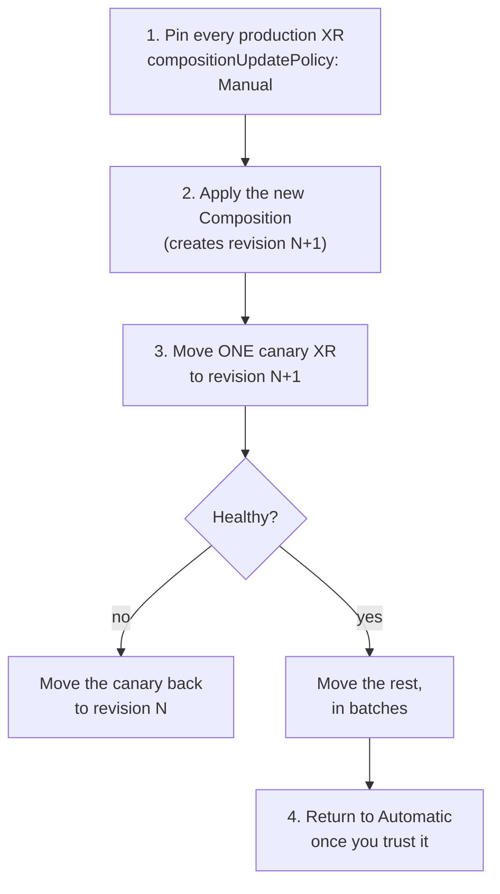

# Module 11 — Day-2 Operations

**Goal:** change a live platform without breaking the infrastructure running on it —
and run scheduled work through the control plane rather than around it.

⏱️ ~2.5 hours · 🎯 Prereq: Module 10.

---

## 1. The day-2 problem

Everything so far has been day 1: build the thing. Day 2 is harder, because now there
are XRs in production and **every change you make to a Composition applies itself
immediately, to all of them, with no approval step.**

Consider what you've already seen:
- Module 10, Part H: renaming a composed resource recreated every bucket.
- Module 07, Part F: flipping `highAvailability` deleted live subnets.
- Module 04's challenge: changing a composition selector deleted an entire stack.

None of those were bugs. They were the reconcile loop doing exactly what it was told,
faster than a human could intervene. **Composition revisions are the mechanism that
puts a human back in the loop when you want one.**

## 2. Composition revisions

Every time you update a Composition, Crossplane creates an immutable
**CompositionRevision**:

```bash
kubectl get compositionrevisions
```
```
NAME                    REVISION   XR-KIND     AGE
xbucket-aws-a1b2c3d     1          XBucket     10d
xbucket-aws-e4f5g6h     2          XBucket     2d
xbucket-aws-i7j8k9l     3          XBucket     5m
```

Each XR is bound to a revision, and `compositionUpdatePolicy` decides whether it
follows new ones:

```yaml
spec:
  crossplane:
    compositionUpdatePolicy: Automatic   # default: always use the latest
    # or
    compositionUpdatePolicy: Manual      # stay put until a human moves me
```

With `Manual`, you pin explicitly:
```yaml
spec:
  crossplane:
    compositionUpdatePolicy: Manual
    compositionRevisionRef:
      name: xbucket-aws-e4f5g6h
```

> **The default is `Automatic`, and that is the right default for most things.** It's
> what makes a fix propagate everywhere instantly. But it also means a bad
> composition change reaches production the moment it's applied.

## 3. A safe rollout

The pattern for a risky composition change:



```bash
# 1. Pin everything
kubectl get xbuckets -A -o name | xargs -I{} kubectl patch {} --type=merge \
  -p '{"spec":{"crossplane":{"compositionUpdatePolicy":"Manual"}}}'

# 2. Apply the change — existing XRs do not move
kubectl apply -f composition-v2.yaml

# 3. Canary one
kubectl patch xbucket canary -n team-a --type=merge \
  -p '{"spec":{"crossplane":{"compositionRevisionRef":{"name":"xbucket-aws-i7j8k9l"}}}}'

# 4. Roll back instantly if it misbehaves
kubectl patch xbucket canary -n team-a --type=merge \
  -p '{"spec":{"crossplane":{"compositionRevisionRef":{"name":"xbucket-aws-e4f5g6h"}}}}'
```

**Rollback is a field change, not a redeploy.** The old revision still exists and is
still valid — that's the whole point of them being immutable.

> **The catch nobody mentions:** rolling back the *composition* does not roll back
> *what it did*. If revision 3 deleted and recreated a bucket, reverting to revision 2
> gives you the old shape — pointed at a bucket that is now empty. Revisions protect
> you from *propagating* a bad change, not from a destructive one that already ran.
> That's why the canary matters.

## 4. Upgrading providers

Providers version independently, and upgrading one is riskier than it looks: a new
provider version can change a resource's schema, its defaults, or how it detects
drift.

```bash
kubectl patch provider provider-aws-s3 --type=merge \
  -p '{"spec":{"package":"xpkg.upbound.io/upbound/provider-aws-s3:v1.22.0"}}'
kubectl get providerrevisions
```

Old revisions stick around, so rollback is the same one-line patch in reverse.

**Before upgrading a provider in production:**
1. Read the release notes for schema changes and new required fields.
2. Upgrade in a non-production cluster first and watch for unexpected diffs.
3. Check for **new late-initialized fields** — the provider may start writing defaults
   into your specs, which shows up as drift in your GitOps diffs.
4. Watch `kubectl get managed` for a wave of `SYNCED=False` immediately after.

> **The failure mode to fear:** a provider upgrade that changes how a field is
> compared, so every existing resource suddenly looks "drifted" and gets updated.
> On a database that's a maintenance window you didn't schedule.

## 5. Operations — scheduled work in the control plane

A Composition maintains state continuously. Sometimes you need something that just
*runs*: a backup, a key rotation, a report, a cleanup.

Crossplane v2 provides three objects, all running function pipelines:

| Kind | Runs | Analogous to |
|------|------|--------------|
| `Operation` | Once, to completion | `Job` |
| `CronOperation` | On a schedule | `CronJob` |
| `WatchOperation` | When a resource changes | A controller |

```yaml
apiVersion: ops.crossplane.io/v1alpha1
kind: CronOperation
metadata:
  name: nightly-snapshot
spec:
  schedule: "0 2 * * *"
  concurrencyPolicy: Forbid
  operationTemplate:
    spec:
      mode: Pipeline
      pipeline:
        - step: snapshot
          functionRef:
            name: function-go-templating
          input: { ... }
```

`concurrencyPolicy` is `Allow` (default), `Forbid`, or `Replace` — what to do when the
previous run is still going.

> **Operations are alpha.** They must be enabled with `--enable-operations` on the
> Crossplane deployment, and the API may change. Know they exist and what they're for;
> don't build your backup strategy on them yet. For production scheduled work today,
> a Kubernetes `CronJob` running `kubectl` or the AWS CLI is the boring, correct
> answer.

## 6. What to check before any change

A pre-flight list worth keeping:

```bash
# What exists now, and is it healthy?
kubectl get managed | grep -v "True *True"

# Which revision is everything on?
kubectl get xbuckets -A -o custom-columns=\
NAME:.metadata.name,REV:.spec.crossplane.compositionRevisionRef.name,POLICY:.spec.crossplane.compositionUpdatePolicy

# What would the new composition actually produce?
crossplane render xr.yaml composition-v2.yaml functions.yaml > /tmp/new.yaml
crossplane render xr.yaml composition-v1.yaml functions.yaml > /tmp/old.yaml
diff /tmp/old.yaml /tmp/new.yaml
```

**That last diff is the closest thing Crossplane has to `terraform plan`** for a
composition change. It won't tell you what a live apply does to existing resources,
but it will show you a renamed resource before it destroys anything — which is the
failure mode most worth catching.

---

## Do the lab
Pin XRs to revisions, roll a change out through a canary, roll it back, upgrade a
provider, and see the limit of what a rollback can undo.
👉 **[lab.md](./lab.md)**

Then: 👉 **[challenge.md](./challenge.md)**

## Manifests
- [`composition-v1.yaml`](./manifests/composition-v1.yaml) / [`composition-v2.yaml`](./manifests/composition-v2.yaml) — a safe change
- [`composition-v3-destructive.yaml`](./manifests/composition-v3-destructive.yaml) — a change that recreates resources
- [`cronoperation.yaml`](./manifests/cronoperation.yaml) — scheduled work
- [`preflight.sh`](./manifests/preflight.sh) — the pre-change checklist, scripted

## Key terms
CompositionRevision · `compositionUpdatePolicy` · `compositionRevisionRef` · canary ·
ProviderRevision · `Operation` · `CronOperation` · `WatchOperation` ·
`concurrencyPolicy`

**Next →** [Module 12: Observability & Debugging](../12-observability-and-debugging/)
