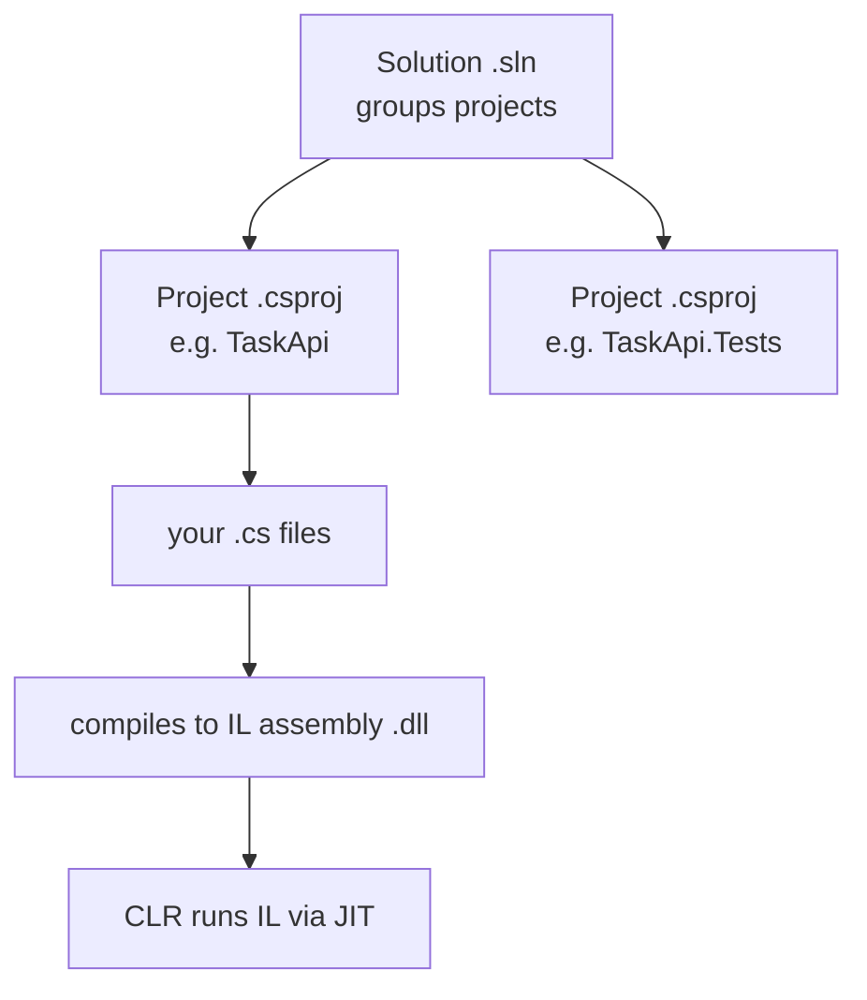

# Module 00 — Setup & Orientation

**Goal:** install the .NET toolchain and an editor on your Mac, and build/run your
first app. ⏱️ ~45 min.

---

## What you're installing

| Tool | What it is | Why |
|------|-----------|-----|
| **.NET 8 SDK** | Compiler + CLI + templates + runtime | Build and run everything in this course |
| **VS Code** + **C# Dev Kit** | Lightweight editor with C# support & debugger | Our default editor (free) |
| **JetBrains Rider** *(optional)* | Full .NET IDE | Excellent if you prefer a heavier IDE (free for non-commercial) |
| **Unity Hub** *(later)* | Manages Unity editor installs | Deferred to Module 10 |

> You only need **one** editor. We give VS Code steps; Rider works identically for
> the labs (its debugger and test runner are first-class).

## Step 1 — Install the .NET 8 SDK

**Option A (Homebrew, recommended):**
```bash
brew install --cask dotnet-sdk
```
**Option B (installer):** download the **.NET 8 SDK** for macOS (Arm64 for Apple
Silicon, x64 for Intel) from <https://dotnet.microsoft.com/download/dotnet/8.0>.

Verify:
```bash
dotnet --version       # 8.0.x
dotnet --info          # confirms your OS/arch and installed SDKs
```
If `dotnet` isn't found, open a new terminal (PATH refresh) or ensure
`/usr/local/share/dotnet` (Intel) or `/usr/local/share/dotnet` / Homebrew's path is
on `PATH`.

## Step 2 — Install an editor

**VS Code:**
```bash
brew install --cask visual-studio-code
```
Then in VS Code, install the **C# Dev Kit** extension (it pulls in the C# extension
and a debugger). Open the Extensions panel (`Cmd+Shift+X`), search "C# Dev Kit", Install.

**Rider (optional alternative):**
```bash
brew install --cask rider
```

## Step 3 — Hello, .NET

```bash
mkdir -p ~/dev/hello && cd ~/dev/hello
dotnet new console -n Hello
cd Hello
dotnet run
```
✅ Expected: `Hello, World!`

Open the folder in your editor and look at the two files:
- **`Program.cs`** — `Console.WriteLine("Hello, World!");` (top-level statements: no
  `Main` boilerplate needed).
- **`Hello.csproj`** — the project file (target framework `net8.0`, etc.).

Try hot reload:
```bash
dotnet watch run     # edit Program.cs, save, watch it rebuild & rerun. Ctrl+C to stop.
```

## Step 4 — The project & solution model (orientation)



- A **project** (`.csproj`) is one buildable unit → compiles to an **assembly**.
- A **solution** (`.sln`) groups related projects (app + tests).
- `dotnet` restores NuGet deps, compiles your C# to **IL**, and the **CLR**
  JIT-compiles IL to native code at run time. The **GC** manages memory for you.

You'll meet all of this hands-on in Module 04.

## Step 5 — Verify
```bash
cd dotnet-course/00-setup
./scripts/verify-setup.sh
```
Then run the full [../VERIFY.md](../VERIFY.md) smoke test once you reach the later apps.

---

## Editor tips
- **Format on save:** enable it; or run `dotnet format`.
- **IntelliSense / go-to-definition:** `F12`; **rename:** `F2`; **quick fix:** `Cmd+.`.
- **Run/Debug:** the C# Dev Kit adds a Run and Debug view; `F5` starts debugging.

## Troubleshooting
- **`dotnet` not found** → new terminal; check PATH; reinstall via Homebrew.
- **`The current .NET SDK does not support 'net8.0'`** → your SDK is older than 8;
  install the .NET 8 SDK.
- **C# features not working in VS Code** → ensure **C# Dev Kit** is installed and the
  workspace opened at the project/solution folder (not a parent).

---

**Next →** [Module 01: C# Fast-Track I](../01-csharp-fast-track-1/)
