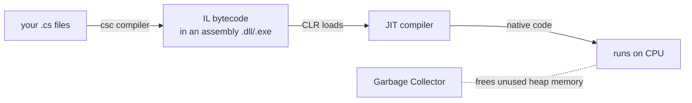

# Module 04 — .NET Runtime & Project Model

**Goal:** understand what actually runs your code (CLR, JIT, GC), how projects/
packages fit together, and **async/await** — the concurrency model you'll lean on in
web apps and contrast with Unity later. ⏱️ ~2 h · 🎯 Prereq: 00–03.

---

## 1. From C# to running code



- The C# compiler produces **IL** (Intermediate Language) inside an **assembly**.
- At run time the **CLR** loads the assembly and the **JIT** compiles IL to native
  code on demand.
- The **Garbage Collector** reclaims heap objects you no longer reference — you rarely
  free memory manually. (Value types often live on the stack; reference types on the
  managed heap.)
- **SDK** builds apps; **Runtime** runs them. You installed the SDK in Module 00.

> Support relevance: "missing assembly" / version-mismatch errors, and GC/memory
> pressure, are real production issues — you now know the moving parts.

## 2. Projects, solutions, and the `.csproj`

```xml
<Project Sdk="Microsoft.NET.Sdk">
  <PropertyGroup>
    <OutputType>Exe</OutputType>
    <TargetFramework>net8.0</TargetFramework>   <!-- the TFM -->
    <Nullable>enable</Nullable>
    <ImplicitUsings>enable</ImplicitUsings>      <!-- auto-imports common namespaces -->
  </PropertyGroup>
  <ItemGroup>
    <PackageReference Include="Serilog" Version="3.1.1" />   <!-- a NuGet dependency -->
  </ItemGroup>
</Project>
```
- **`<TargetFramework>`** (TFM): `net8.0` here.
- **`ImplicitUsings`**: common `using`s (`System`, `System.Linq`, …) are added for you.
- A **solution** (`.sln`) groups projects:
  ```bash
  dotnet new sln -n Demo
  dotnet sln add MyApp/MyApp.csproj MyApp.Tests/MyApp.Tests.csproj
  dotnet add MyApp.Tests/MyApp.Tests.csproj reference MyApp/MyApp.csproj
  ```

## 3. NuGet packages

```bash
dotnet add package Newtonsoft.Json            # latest
dotnet add package Serilog --version 3.1.1    # pinned (preferred for reproducibility)
dotnet list package                            # what's installed
dotnet list package --outdated
```
Packages restore into a global cache and are referenced (not copied) — `dotnet
restore`/`build` handles it. Pin versions for reproducible builds.

## 4. async/await & Tasks

I/O (HTTP, DB, files) is slow; blocking a thread waiting wastes it. **async/await**
frees the thread while waiting, so the app scales (this is *why* ASP.NET Core is async
throughout).

```csharp
async Task<string> FetchTitleAsync(HttpClient http, string url)
{
    string html = await http.GetStringAsync(url);   // yields the thread while waiting
    return html.Length.ToString();
}
```
Rules of thumb:
- An `async` method returns **`Task`** (no result) or **`Task<T>`** (a result).
- `await` unwraps a `Task<T>` to its `T`, resuming when it completes.
- Run things **concurrently** by starting tasks, then awaiting together:
  ```csharp
  var t1 = FetchAsync(a); var t2 = FetchAsync(b);
  var results = await Task.WhenAll(t1, t2);   // overlap, not sequential
  ```
- **Don't** block on async with `.Result`/`.Wait()` (deadlocks, thread starvation).
- Name async methods `...Async` by convention.

> **Unity contrast (foreshadowing Module 11):** Unity gameplay generally does *not*
> use `async` for per-frame timing — it uses the **frame loop** (`Update`) and
> **coroutines** instead. Same C# language, different concurrency model.

## 5. Memory & disposal recap

- The GC handles managed memory; you don't `free`.
- But **unmanaged** resources (files, sockets, DB connections) need `IDisposable` +
  `using` (Module 03) for *deterministic* release — don't wait for the GC.

---

## Do the lab
Create a multi-project solution (lib + app + tests), add a NuGet package, and measure
async concurrency vs sequential. 👉 **[lab.md](./lab.md)**

Then: 👉 **[challenge.md](./challenge.md)**

## Key terms
IL · CLR · JIT · GC · assembly · SDK vs runtime · `.csproj`/TFM · `.sln` ·
ImplicitUsings · NuGet `PackageReference` · `Task`/`Task<T>` · `await` · `Task.WhenAll`

**Next →** [Module 05: Debugging & Testing](../05-debugging-and-testing/)
