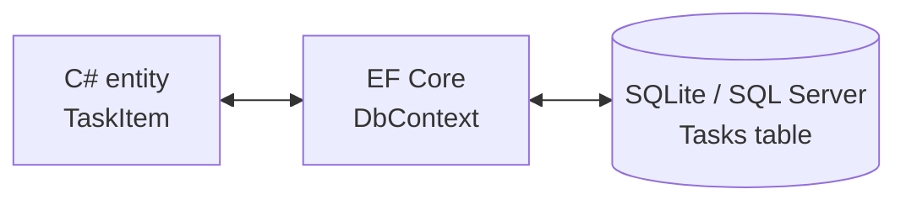

# Module 08 — Data Access with EF Core

**Goal:** persist data the way most .NET apps do — with **Entity Framework Core**:
model classes ↔ tables, **migrations** for schema, and LINQ queries that become SQL.
⏱️ ~2.5 h · 🎯 Prereq: 00–07.

---

## 1. What an ORM does

Writing raw SQL + manual mapping is tedious and error-prone. **EF Core** is an ORM:
you define C# **entity** classes, and it maps them to tables, tracks changes, and
generates SQL for your LINQ queries.



## 2. The `DbContext` and entities

```csharp
public class TaskItem                 // entity
{
    public int Id { get; set; }        // convention: 'Id' is the primary key
    public string Title { get; set; } = "";
    public bool IsDone { get; set; }
    public DateTime CreatedAt { get; set; }
}

public class TaskDbContext(DbContextOptions<TaskDbContext> options) : DbContext(options)
{
    public DbSet<TaskItem> Tasks => Set<TaskItem>();   // a DbSet per table
}
```
Register it (note: **Scoped** lifetime — one per request):
```csharp
builder.Services.AddDbContext<TaskDbContext>(o => o.UseSqlite("Data Source=tasks.db"));
```
SQLite is a zero-install file database — perfect for local dev. Swapping to SQL
Server is one line: `o.UseSqlServer(connectionString)`.

## 3. Migrations (versioned schema changes)

Migrations turn changes to your entities into **code-generated, reviewable** schema
updates you apply to the database.

```bash
dotnet tool install --global dotnet-ef          # one-time
dotnet ef migrations add InitialCreate          # generate from the current model
dotnet ef database update                       # apply to the DB
# later, after changing entities:
dotnet ef migrations add AddPriorityColumn
dotnet ef database update
```
Apply automatically at startup with `db.Database.Migrate();` (production-friendly),
versus `EnsureCreated()` (quick demos only — **don't mix the two**).

> **Support reality:** "a migration failed in prod" is a common ticket. Migrations are
> ordered; never edit an applied one — add a new migration to change things.

## 4. CRUD with `DbSet` + `SaveChanges`

```csharp
// Create
db.Tasks.Add(new TaskItem { Title = "learn EF" });
await db.SaveChangesAsync();             // INSERT happens here

// Read
var one  = await db.Tasks.FindAsync(id);                 // by primary key
var open = await db.Tasks.Where(t => !t.IsDone).ToListAsync();

// Update (EF tracks the loaded entity)
var t = await db.Tasks.FindAsync(id);
t!.IsDone = true;
await db.SaveChangesAsync();              // UPDATE only the changed row

// Delete
db.Tasks.Remove(t);
await db.SaveChangesAsync();              // DELETE
```
`SaveChangesAsync()` is where EF computes and runs the SQL for everything you changed,
in a transaction.

## 5. LINQ-to-Entities (queries become SQL)

```csharp
var recentDone = await db.Tasks
    .Where(t => t.IsDone && t.CompletedAt >= since)
    .OrderByDescending(t => t.CompletedAt)
    .Take(10)
    .ToListAsync();
```
EF translates this to a single SQL query. Two big gotchas:
- **Keep it translatable.** Calling your own C# methods inside `Where/Select` over a
  `DbSet` can throw "could not be translated". Materialize first (`ToListAsync()`)
  *then* map, as `TaskService.GetAllAsync` does.
- **Don't pull the whole table.** Put `Where`/filters **before** `ToList`, so filtering
  happens in SQL, not in memory.
- **N+1 queries.** Loading related data in a loop fires many queries; use `Include()`
  for related entities, or project what you need.

---

## Do the lab
Wire TaskApi to SQLite with EF Core, create and apply a migration, do CRUD, then add a
column via a second migration. 👉 **[lab.md](./lab.md)**

Then: 👉 **[challenge.md](./challenge.md)**

## Reference
Completed app: [`apps/TaskApi`](../apps/TaskApi/) — `Data/TaskDbContext.cs`,
`Services/TaskService.cs`.

## Key terms
ORM · entity · `DbContext`/`DbSet` · Scoped lifetime · migration ·
`migrations add`/`database update` · `Migrate()` vs `EnsureCreated()` · CRUD ·
`SaveChangesAsync` · LINQ-to-Entities · translation · `Include` · N+1

**Next →** [Module 09: Operate & Support (Capstone A)](../09-operate-and-support/)
