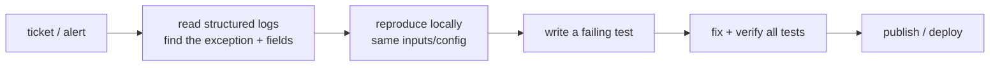

# Module 09 — Operate & Support (Capstone A)

**Goal:** ship and run a .NET app like you'll support it in production — publish,
containerize, expose health checks — and **diagnose a deliberately broken app** using
everything from Phase 1. ⏱️ ~3 h · 🎯 Prereq: 00–08.

---

## 1. Publishing

`dotnet run` is for dev. To deploy, you **publish** an optimized output:
```bash
dotnet publish -c Release -o ./publish
# framework-dependent: needs the .NET 8 runtime on the target (small output)

dotnet publish -c Release -r osx-arm64 --self-contained -o ./publish-sc
# self-contained: bundles the runtime (no install on target; larger output)
```
- **Framework-dependent** — smaller, requires the matching runtime installed.
- **Self-contained** — runs anywhere of that OS/arch, no .NET install needed.
- Run the result: `dotnet ./publish/TaskApi.dll` (or the native exe for self-contained).

## 2. Containerizing (optional but common)

A minimal multi-stage Dockerfile builds then runs the app:
```dockerfile
FROM mcr.microsoft.com/dotnet/sdk:8.0 AS build
WORKDIR /src
COPY . .
RUN dotnet publish src/TaskApi/TaskApi.csproj -c Release -o /app

FROM mcr.microsoft.com/dotnet/aspnet:8.0
WORKDIR /app
COPY --from=build /app .
EXPOSE 8080
ENV ASPNETCORE_URLS=http://+:8080
ENTRYPOINT ["dotnet", "TaskApi.dll"]
```
.NET 8 can also build images without a Dockerfile: `dotnet publish -p:PublishProfile=DefaultContainer`.

## 3. Health checks

A `/health` endpoint lets orchestrators (and you) know the app is alive. TaskApi
already maps one:
```csharp
builder.Services.AddHealthChecks();        // add DB/dependency checks for richer health
app.MapHealthChecks("/health");
```
Extend with dependency checks (e.g. the database) so `/health` is meaningful, not just
"the process is up".

## 4. Production diagnosis workflow (the support core)

When a ticket arrives, you rarely have a debugger attached to prod. You have **logs**,
**config**, and **the binary**. The reliable loop:



This ties together: stack traces & the debugger (05), structured logs & config (06),
the API surface (07), and the data layer (08).

## 5. The lab: diagnose a broken app

The lab plants **four realistic bugs** into a copy of TaskApi and has you find each
using only logs, `curl`, tests, and reading code:
1. a **configuration** error (wrong/missing setting),
2. an **unhandled exception** path (a 500),
3. a **data/translation** bug (a query that throws),
4. a **dependency injection** mistake (missing registration / wrong lifetime).

For each: observe the symptom → form a hypothesis → confirm → fix → add a test.

---

## Capstone A — your deliverable

Take **TaskApi** and make it production-shaped end-to-end:
- ✅ EF Core persistence with a **migration** applied (Module 08).
- ✅ **Structured logging** + environment-based config + a secret via user-secrets (06).
- ✅ A meaningful **/health** check (adds a DB check).
- ✅ **xUnit tests** for the service layer, all green (05).
- ✅ A **published** artifact (framework-dependent) that runs.
- ✅ You can **diagnose** each of the four planted bugs and explain the fix.

A self-assessment **rubric** is in [`solutions/RUBRIC.md`](./solutions/RUBRIC.md).

## Do the lab
👉 **[lab.md](./lab.md)** · then 👉 **[challenge.md](./challenge.md)**

## Key terms
`dotnet publish` · framework-dependent vs self-contained · Dockerfile multi-stage ·
health checks · production diagnosis loop · root-cause analysis

**Next →** [Module 10: Unity Setup & Editor](../10-unity-setup-and-editor/) — on to games!
