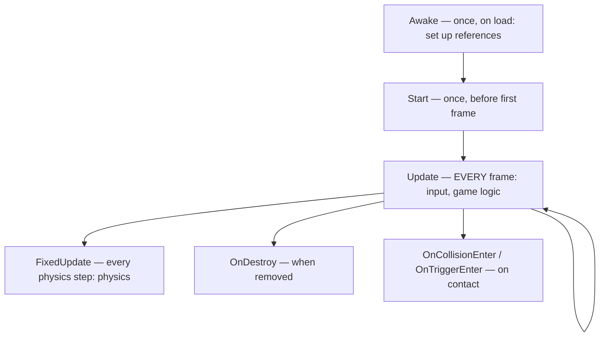

# Module 11 — Scripting in Unity

**Goal:** write gameplay in C# the Unity way — the **MonoBehaviour lifecycle**, input,
moving things, spawning/destroying, prefabs, and ScriptableObjects — and understand how
Unity's C# differs from the .NET you learned. ⏱️ ~2.5 h · 🎯 Prereq: Modules 01–04, 10.

---

## 1. MonoBehaviour & the lifecycle (no `Main`!)

In a console/web app, **you** call methods. In Unity, the **engine** calls *your*
methods at the right times. Your scripts derive from `MonoBehaviour`; the engine
invokes lifecycle hooks:


- **`Awake`** — initialize references (runs before any `Start`).
- **`Start`** — one-time setup before the first frame.
- **`Update`** — runs **every frame**; put input + general logic here.
- **`FixedUpdate`** — runs on the fixed physics clock; put **physics** (forces) here.
- **`OnTriggerEnter2D` / `OnCollisionEnter2D`** — react to contacts (Module 12).
- **`OnDestroy`** — cleanup.

You don't call these; you *implement the ones you need* and Unity calls them.

## 2. Frame-rate independence: `Time.deltaTime`

`Update` runs more often on fast machines. To move at a consistent real-world speed,
multiply by `Time.deltaTime` (seconds since last frame):
```csharp
transform.position += direction * (speed * Time.deltaTime);   // "units per second"
```
Forget this and your game runs faster on better hardware — a classic beginner bug.

## 3. Input

```csharp
float h = Input.GetAxisRaw("Horizontal");        // -1..1 (arrows / A,D)
if (Input.GetKeyDown(KeyCode.Space)) Jump();      // edge-triggered (once per press)
if (Input.GetMouseButtonDown(0)) Fire();          // left click
```
(Unity also has a newer **Input System** package; the built-in `Input` class above is
the simplest place to start.)

## 4. Transforms, Instantiate, Destroy

```csharp
transform.position += Vector3.right * step;       // move
transform.Rotate(0, 0, 90 * Time.deltaTime);      // spin
GameObject clone = Instantiate(prefab, pos, Quaternion.identity);  // spawn a prefab
Destroy(clone, 2f);                               // remove after 2s
```
`Vector3`/`Vector2` are value types (structs) — like the value types from Module 01.

## 5. Prefabs (reusable GameObject templates)

A **prefab** is a saved GameObject (with its components + values) you can instantiate
many times. Build a GameObject in a scene, drag it into the **Project** panel to make a
prefab, then `Instantiate` it at runtime (e.g. coins, bullets, enemies). Editing the
prefab asset updates all instances.

## 6. ScriptableObjects (data as assets)

A **ScriptableObject** holds shared data **outside** any scene — great for tuning
(speeds, scores, item definitions) without hardcoding. You create asset instances in
the editor and reference them from scripts. See
[`unity-scripts/GameSettings.cs`](../unity-scripts/GameSettings.cs).

## 7. Unity C# vs vanilla .NET (read this twice)

| Vanilla .NET (Phase 0–1) | Unity |
|--------------------------|-------|
| `Main` entry point; you drive control flow | **No `Main`**; the engine drives via lifecycle hooks |
| `async/await` for concurrency | mostly the **frame loop** + **coroutines** (`yield return`) |
| Threads / `Task.Run` | most Unity APIs are **main-thread only**; be careful off-thread |
| `Console.WriteLine` | `Debug.Log` (to the Console) |
| `new` your objects freely | GameObjects via `Instantiate`; components via `AddComponent` |
| DI container | references via `[SerializeField]` + `GetComponent` |
| GC same idea | GC exists, but avoid per-frame allocations (perf) |

**Coroutines** (Unity's "do this over several frames"):
```csharp
IEnumerator Flash()
{
    for (int i = 0; i < 3; i++)
    {
        Debug.Log("flash");
        yield return new WaitForSeconds(0.5f);   // resume half a second later
    }
}
// start it: StartCoroutine(Flash());
```
It's the same C# you know — different runtime model.

---

## Do the lab
Move a player with input, spawn prefabs, and drive tuning from a ScriptableObject.
👉 **[lab.md](./lab.md)**

Then: 👉 **[challenge.md](./challenge.md)**

## Reference scripts
[`unity-scripts/TransformMover.cs`](../unity-scripts/TransformMover.cs) ·
[`Spawner.cs`](../unity-scripts/Spawner.cs) ·
[`GameSettings.cs`](../unity-scripts/GameSettings.cs)

## Key terms
`MonoBehaviour` · Awake/Start/Update/FixedUpdate/OnDestroy · `Time.deltaTime` · `Input` ·
`Vector2`/`Vector3` · `Instantiate`/`Destroy` · prefab · `ScriptableObject` · coroutine ·
`GetComponent`

**Next →** [Module 12: Build a 2D Game](../12-unity-2d-game/)
