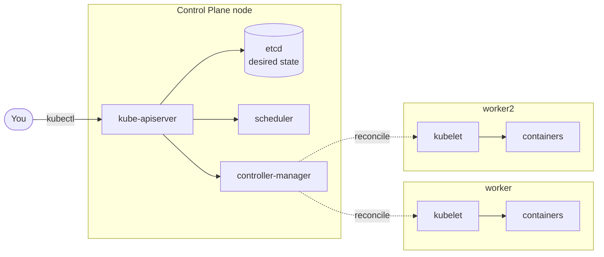

# Module 00 — Setup & Orientation

**Goal:** install the toolchain on your Mac and spin up a real 3-node Kubernetes
cluster you'll use for the rest of the course.

⏱️ ~45 minutes · 🎯 By the end you'll have a healthy local cluster and know what
each tool does.

---

## What we're installing and why

| Tool | What it is | Why we need it |
|------|-----------|----------------|
| **Docker Desktop** | Runs containers on your Mac | kind runs Kubernetes *inside* Docker containers |
| **kind** | "Kubernetes IN Docker" | Creates real multi-node clusters locally, fast and free |
| **kubectl** | The Kubernetes CLI | How you talk to the cluster (it's an API client) |
| **helm** | Kubernetes package manager | Install add-ons (Prometheus, etc.) and package apps (Module 10) |
| **k9s** | Terminal UI for clusters | A friendly live dashboard — optional but lovely |
| **kubectx / kubens** | Context & namespace switchers | Stop typing long `--namespace` flags |

> **Why kind instead of Docker Desktop's built-in Kubernetes or minikube?**
> Docker Desktop's K8s is single-node, which hides scheduling and networking
> behavior. kind gives you a genuine **multi-node** cluster (1 control plane + 2
> workers) so labs on placement, high availability, and node failure actually
> *do something*. It's also scriptable and quick to recreate.

---

## Step 1 — Install Docker Desktop

1. Download from <https://www.docker.com/products/docker-desktop/> (or `brew install --cask docker`).
2. Launch it. Wait until the whale icon in the menu bar stops animating.
3. **Give it enough resources** (kind needs headroom):
   Docker Desktop → **Settings → Resources** →
   - **CPUs:** at least **4**
   - **Memory:** at least **6 GB** (8 GB recommended)
   - Apply & Restart.

Verify:
```bash
docker version     # both Client and Server sections should appear
docker run --rm hello-world
```

## Step 2 — Install the CLI tools (Homebrew)

```bash
brew install kind kubectl helm k9s kubectx
```

Verify:
```bash
kind version
kubectl version --client
helm version
```

## Step 3 — (Recommended) shell quality-of-life

Add to your `~/.zshrc`, then `source ~/.zshrc`:
```bash
alias k=kubectl
source <(kubectl completion zsh)
complete -o default -F __start_kubectl k
export do="--dry-run=client -o yaml"   # quick manifest generation
```

## Step 4 — Create your cluster

We've provided a [kind config](./manifests/kind-cluster.yaml) that defines a
1-control-plane + 2-worker cluster and maps ports 80/443 so Ingress works later.

```bash
cd 00-setup
./scripts/create-cluster.sh
```

This runs (roughly):
```bash
kind create cluster --name k8s-course --config manifests/kind-cluster.yaml
```

## Step 5 — Verify

```bash
./scripts/verify-setup.sh
```
✅ Expected: tool versions print, then **3 nodes `Ready`**:
```
k8s-course-control-plane   Ready   control-plane
k8s-course-worker          Ready   <none>
k8s-course-worker2         Ready   <none>
```

Then run the full smoke test in [../VERIFY.md](../VERIFY.md) to confirm you can
build, load, and run the sample app.

---

## Orientation: the mental model



- You declare *what you want* via `kubectl` → the **api-server**.
- Desired state is stored in **etcd**.
- The **scheduler** picks nodes; the **controller-manager** runs loops to make
  reality match your declaration.
- On each worker, the **kubelet** starts/stops the actual containers.

You'll explore all of this hands-on in Module 02.

---

## Daily workflow

```bash
00-setup/scripts/create-cluster.sh   # start of session (idempotent)
00-setup/scripts/delete-cluster.sh   # end of session — frees your laptop's RAM
```
Your cluster state is disposable. Recreating it takes ~1 minute, and since all
labs are declarative YAML, you can always re-`apply` your way back.

---

## Troubleshooting setup

- **`docker: Cannot connect to the Docker daemon`** → Docker Desktop isn't running. Start it.
- **`kind create cluster` hangs or fails on memory** → bump Docker Desktop memory (Step 1).
- **Nodes stuck `NotReady`** → wait 30–60s for the CNI to start; re-run `kubectl get nodes`.
- **`kubectl` points at the wrong cluster** → `kubectl config use-context kind-k8s-course`.

---

**Next →** [Module 01: Containers & Docker Primer](../01-containers-docker/)
