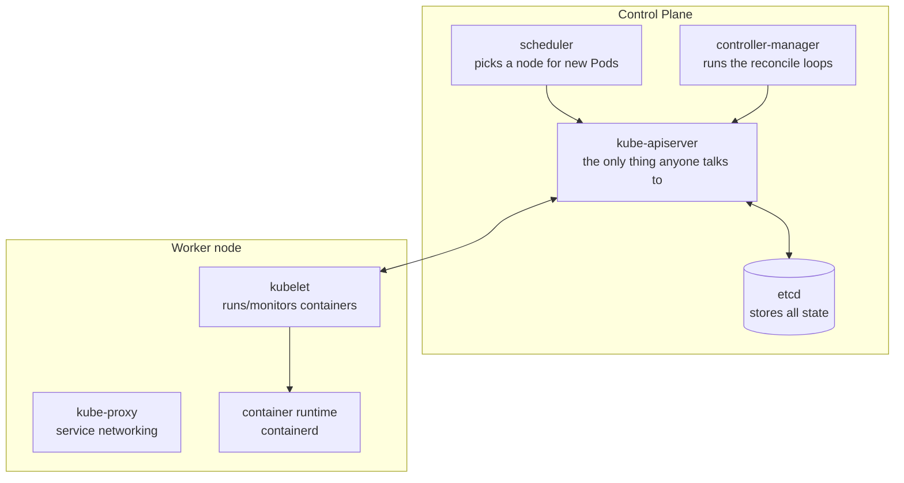

# Module 02 — Kubernetes Fundamentals

**Goal:** understand how a Kubernetes cluster is built and learn to drive `kubectl`
with confidence. This is the mental model the rest of the course rests on.

⏱️ ~1.5 hours · 🎯 Prereq: Modules 00–01.

---

## 1. The one idea that explains everything: reconciliation

You don't tell Kubernetes *how* to do things step by step. You declare the
**desired state** ("I want 3 copies of this app running"), and Kubernetes runs
**control loops** that continuously:

```
   observe actual state  →  compare to desired state  →  act to close the gap  →  (repeat forever)
```

Kill a Pod? A loop notices "desired 3, actual 2" and creates a replacement. This
single idea — **declarative + reconciliation** — is why Kubernetes is self-healing.

## 2. Cluster architecture



**Control plane = the brain:**
- **kube-apiserver** — the front door. *Everything* (you, controllers, kubelets)
  talks to the API server, never to each other directly.
- **etcd** — the database. The single source of truth for desired + observed state.
- **scheduler** — watches for Pods with no node assigned and picks the best node.
- **controller-manager** — bundles the control loops (Deployment controller,
  ReplicaSet controller, etc.) that drive reconciliation.

**Every node (workers + control plane):**
- **kubelet** — the node agent. Talks to the API server, starts/stops containers
  via the runtime, reports health.
- **kube-proxy** — programs network rules so Services route correctly.
- **container runtime** — actually runs containers (containerd).

> In your kind cluster, each "node" is a Docker container. `docker ps` will show
> `k8s-course-control-plane`, `k8s-course-worker`, `k8s-course-worker2`.

## 3. What happens when you `kubectl apply` a Deployment

```
1. kubectl sends the manifest to the api-server.
2. api-server validates it and writes the desired state to etcd.
3. Deployment controller sees it, creates a ReplicaSet.
4. ReplicaSet controller sees it, creates Pod objects (still unscheduled).
5. Scheduler sees Pods with no node, assigns each to a node.
6. The kubelet on that node sees "a Pod is assigned to me", tells containerd
   to pull the image and start the container.
7. kubelet reports status back to the api-server → etcd.
8. kubectl get pods reads that status back to you.
```

Notice: no component commands another. They all **watch the API server** and react.

## 4. `kubectl` is just an API client

When you run `kubectl get pods`, kubectl makes an HTTPS GET to the api-server and
prints the JSON it gets back. Useful consequences:

- `kubectl explain <kind>` gives you the API docs for any object's fields.
- `kubectl get <kind> -o yaml` shows the full object as stored.
- `kubectl <verb> -v=8 ...` shows the actual HTTP requests (great for learning).

## 5. Imperative vs declarative

| Style | Example | Use when |
|-------|---------|----------|
| **Imperative** | `kubectl run`, `kubectl create`, `kubectl scale` | Quick experiments, throwaway pods |
| **Declarative** | `kubectl apply -f file.yaml` | Real work — reviewable, repeatable, version-controlled |

Pro workflow: use imperative commands with `--dry-run=client -o yaml` to *generate*
declarative YAML, then refine and `apply` it.

## 6. Namespaces

Namespaces partition a cluster into virtual sub-clusters for grouping and isolation
(e.g. `dev`, `prod`, `kube-system` for cluster components). Names must be unique
*within* a namespace, not across them.

---

## Do the lab
Explore your live cluster's internals, run your first Pod imperatively, then
convert it to declarative YAML. 👉 **[lab.md](./lab.md)**

Then: 👉 **[challenge.md](./challenge.md)**

## Key terms
control plane · api-server · etcd · scheduler · controller-manager · kubelet ·
kube-proxy · reconciliation · declarative · namespace

**Next →** [Module 03: Pods & Core Workloads](../03-pods-and-workloads/)
