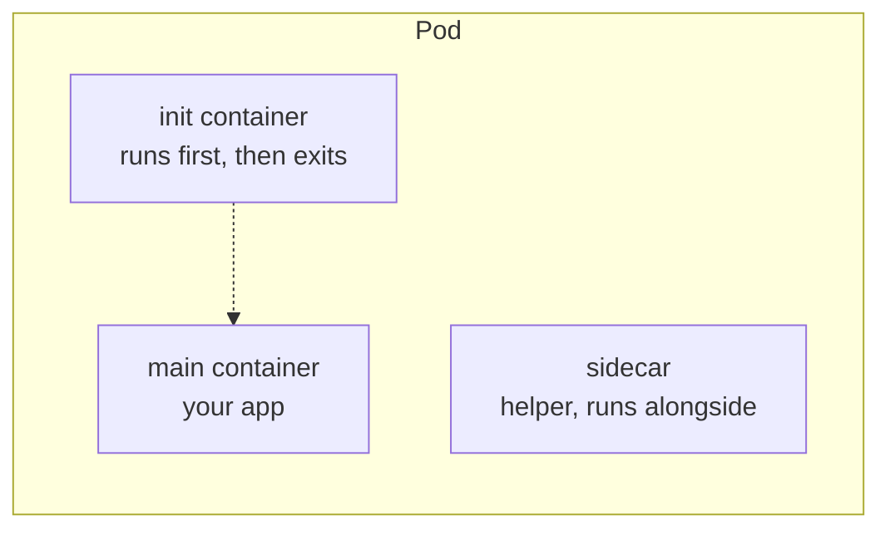
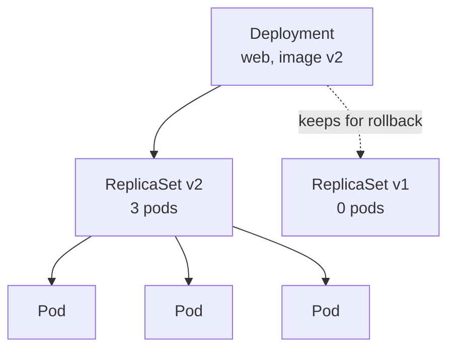

# Module 03 — Pods & Core Workloads

**Goal:** master the objects you'll use every day — Pods, ReplicaSets, and
especially **Deployments** — including scaling, rolling updates, and rollbacks.

⏱️ ~2 hours · 🎯 Prereq: Modules 00–02. Make sure `web-api:1.0` is loaded into kind
(Module 01 Part D).

---

## 1. Pods

A **Pod** is the smallest deployable unit. It wraps **one or more containers** that:
- share a network namespace (same IP; they reach each other on `localhost`),
- can share storage volumes,
- are always scheduled together onto the same node and live/die together.

**Usually one main container per Pod.** Extra containers are for helper patterns:

- **init containers** run to completion *before* the main container starts (setup,
  waiting for a dependency, fetching config). They run in order.
- **sidecars** run alongside the main container (log shipper, proxy, file syncer).



**You rarely create bare Pods directly.** They aren't self-healing (Module 02).
Instead you use a controller that manages Pods for you.

## 2. Labels, selectors, annotations

- **Labels** are key/value tags (`app=web`, `tier=frontend`) used to *select* and
  group objects. This is how Deployments find their Pods and Services find their
  endpoints.
- **Selectors** query by label (`-l app=web`).
- **Annotations** hold non-identifying metadata (descriptions, tool hints). Not
  used for selection.

Labels are the connective tissue of Kubernetes — get comfortable with them.

## 3. ReplicaSets

A **ReplicaSet** keeps *N* identical Pods running. If one dies, it makes another;
if there are too many, it deletes some. It finds "its" Pods by label selector.

You almost never create ReplicaSets directly — a **Deployment** manages them for you.

## 4. Deployments (your default workload)

A **Deployment** manages ReplicaSets to give you:
- **Declarative updates** — change the image/config and `apply`; it rolls out the change.
- **Rolling updates** — replaces Pods gradually (no downtime), governed by
  `maxSurge` / `maxUnavailable`.
- **Rollbacks** — `kubectl rollout undo` reverts to a previous ReplicaSet.
- **Scaling** — `replicas: N` or `kubectl scale`.



During a rolling update the Deployment creates a *new* ReplicaSet, scales it up
while scaling the old one down, and keeps the old one around (at 0 replicas) so you
can roll back.

## 5. The relationship in one line

```
Deployment  manages→  ReplicaSet  manages→  Pods  contain→  Containers
```

---

## Do the lab
Deploy `web-api`, scale it, watch a load balancer hit different Pods, perform a
rolling update to v2, then roll it back. 👉 **[lab.md](./lab.md)**

Then: 👉 **[challenge.md](./challenge.md)**

## Manifests in this module
- [`manifests/web-deploy.yaml`](./manifests/web-deploy.yaml) — a 3-replica Deployment of `web-api`
- [`manifests/pod-with-init.yaml`](./manifests/pod-with-init.yaml) — init-container demo

## Key terms
Pod · init container · sidecar · label · selector · annotation · ReplicaSet ·
Deployment · rolling update · rollback

**Next →** [Module 04: Configuration & Lifecycle](../04-configuration/)
