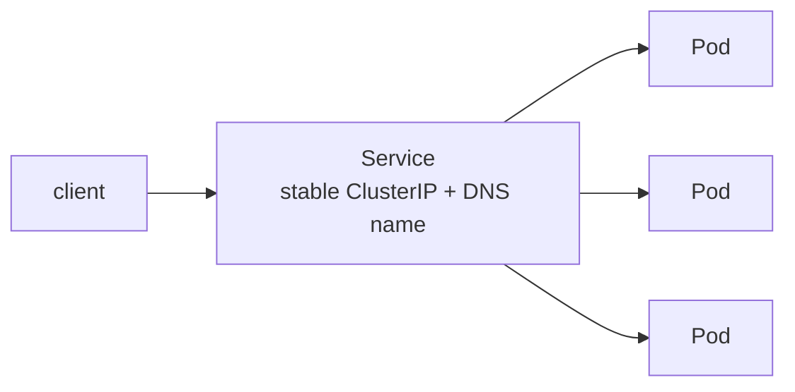
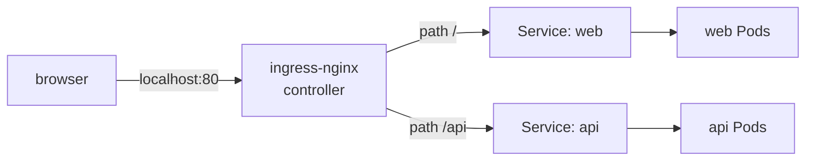

# Module 05 — Networking: Services, DNS & Ingress

**Goal:** make your Pods reachable and able to find each other. Understand Service
types, cluster DNS, and HTTP routing with Ingress.

⏱️ ~2 hours · 🎯 Prereq: Modules 00–04.

---

## 1. The problem Services solve

Pods are **ephemeral** — they come and go, each with a new IP. You can't hardcode a
Pod IP. A **Service** gives a *stable* virtual IP and DNS name that load-balances
across a changing set of Pods (selected by label).



The Service's backend set is its **endpoints** — the IPs of Ready Pods matching its
selector. If readiness fails (Module 04), the Pod drops out of the endpoints.

## 2. The cluster network model

Three flat networks coexist:
- **Pod network** — every Pod gets its own IP; Pods can reach each other directly
  across nodes (the CNI makes this work; in kind it's `kindnet`).
- **Service network** — virtual ClusterIPs (not real interfaces); `kube-proxy`
  programs rules that redirect traffic to a backing Pod.
- **Node network** — the nodes themselves.

## 3. Service types

| Type | What it gives you | Reachable from |
|------|-------------------|----------------|
| **ClusterIP** (default) | Stable internal IP + DNS | Inside the cluster only |
| **NodePort** | Opens a port (30000–32767) on *every* node | Outside, via `node-ip:nodeport` |
| **LoadBalancer** | Asks the infra for an external IP | Outside, via that IP (needs a cloud or a local emulator like MetalLB) |
| **headless** (`clusterIP: None`) | No virtual IP — DNS returns Pod IPs directly | For StatefulSets / client-side LB |

For local exposure during development you usually just use `kubectl port-forward`
or an **Ingress** (below), rather than NodePort/LoadBalancer.

## 4. Service discovery via DNS

CoreDNS gives every Service a DNS name:

```
<service>.<namespace>.svc.cluster.local
```

So a Pod in `default` can reach a Service named `web` at simply `web` (same
namespace), or `web.default.svc.cluster.local` (fully qualified, cross-namespace).
**This is how microservices find each other** — by name, not IP.

## 5. Ingress (HTTP routing)

A Service of type LoadBalancer per app is wasteful. **Ingress** is a single entry
point that routes HTTP(S) by **host** and **path** to different Services:

```
http://localhost/        -> web Service
http://localhost/api     -> api Service
shop.example.com         -> shop Service
```

Ingress is just *rules*. You need an **Ingress Controller** (e.g. ingress-nginx) —
a Pod that actually watches Ingress objects and does the routing. We install
ingress-nginx's kind-specific build, which uses the port mappings (80/443) we set
in the kind config back in Module 00.



## 6. port-forward (your local dev friend)

`kubectl port-forward` tunnels a local port straight to a Pod or Service through the
API server — perfect for poking at something without exposing it. It's for
development, not production.

---

## Do the lab
Expose `web-api` with a ClusterIP Service, see DNS-based load balancing, try a
NodePort, then install ingress-nginx and route to two apps by path.
👉 **[lab.md](./lab.md)**

Then: 👉 **[challenge.md](./challenge.md)**

## Manifests
- [`deploy-and-service.yaml`](./manifests/deploy-and-service.yaml) — web Deployment + ClusterIP Service
- [`nodeport.yaml`](./manifests/nodeport.yaml) — NodePort variant
- [`second-app.yaml`](./manifests/second-app.yaml) — a second app to route to
- [`ingress.yaml`](./manifests/ingress.yaml) — path-based Ingress for both apps

## Key terms
Service · ClusterIP · NodePort · LoadBalancer · headless · endpoints · CoreDNS ·
Ingress · Ingress Controller · port-forward

**Next →** [Module 06: Storage](../06-storage/)
