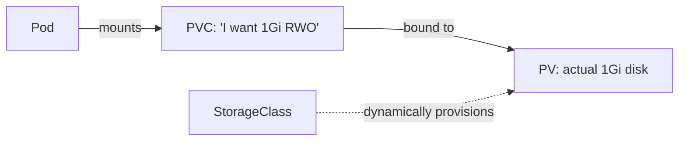

# Module 06 — Storage

**Goal:** persist data beyond a Pod's lifetime. Understand Volumes, the
PV/PVC abstraction, and dynamic provisioning with StorageClasses.

⏱️ ~1.5 hours · 🎯 Prereq: Modules 00–05.

---

## 1. Why storage is tricky

A container's filesystem is **ephemeral** — when the container restarts or the Pod
is rescheduled, anything written inside is gone. Databases, uploads, and caches
need storage that *outlives* the Pod. That's what Kubernetes Volumes provide.

## 2. Volumes (Pod-scoped)

A **Volume** is storage mounted into a Pod's containers. Lifetime depends on type:

- **`emptyDir`** — created when the Pod starts, deleted when the Pod dies. Good for
  scratch space and sharing files *between containers in the same Pod* (you used
  this in Module 03's init demo).
- **`configMap` / `secret`** — mount config/secret data as files (Module 04).
- **`persistentVolumeClaim`** — mounts *durable* storage that survives the Pod.

## 3. The PV / PVC abstraction (the important bit)

Kubernetes splits storage into supply and demand so app authors don't need to know
storage details:

- **PersistentVolume (PV)** — a piece of actual storage in the cluster (a disk, an
  NFS share, a cloud volume). *Supply.* Often created automatically (see §4).
- **PersistentVolumeClaim (PVC)** — a request: "I need 1Gi, ReadWriteOnce." *Demand.*
  Your Pod references the **PVC**, not the PV.

Kubernetes **binds** a PVC to a suitable PV. Your Pod mounts the PVC and neither
knows nor cares what the underlying storage actually is.



## 4. StorageClasses & dynamic provisioning

Manually creating PVs is tedious. A **StorageClass** describes a *kind* of storage
and a **provisioner** that creates PVs **on demand** when a PVC asks for that class.

Your kind cluster ships with a default StorageClass (`standard`, backed by the
local-path provisioner). So you just create a PVC → a PV is created automatically →
it binds. Check yours:

```bash
kubectl get storageclass
```

## 5. Access modes

- **ReadWriteOnce (RWO)** — mounted read/write by a single node (most common; local
  disks and most cloud block storage).
- **ReadOnlyMany (ROX)** — read-only by many nodes.
- **ReadWriteMany (RWX)** — read/write by many nodes (needs networked storage like NFS).

kind's local-path provisioner supports **RWO**.

## 6. Reclaim policy

When a PVC is deleted, the PV's `persistentVolumeReclaimPolicy` decides the fate of
the data: **Delete** (storage removed) or **Retain** (kept for manual recovery).
Dynamically provisioned volumes usually default to `Delete`.

---

## Do the lab
Create a PVC, mount it in a Pod, write data, delete and recreate the Pod, and prove
the data survived. 👉 **[lab.md](./lab.md)**

Then: 👉 **[challenge.md](./challenge.md)**

## Manifests
- [`pvc.yaml`](./manifests/pvc.yaml) — a 1Gi PersistentVolumeClaim
- [`pod-with-pvc.yaml`](./manifests/pod-with-pvc.yaml) — a Pod that mounts it
- [`emptydir-pod.yaml`](./manifests/emptydir-pod.yaml) — ephemeral volume for contrast

## Key terms
Volume · emptyDir · PersistentVolume · PersistentVolumeClaim · binding ·
StorageClass · provisioner · access mode · reclaim policy

**Next →** [Module 07: Controllers — Jobs & StatefulSets](../07-controllers-jobs-statefulsets/)
