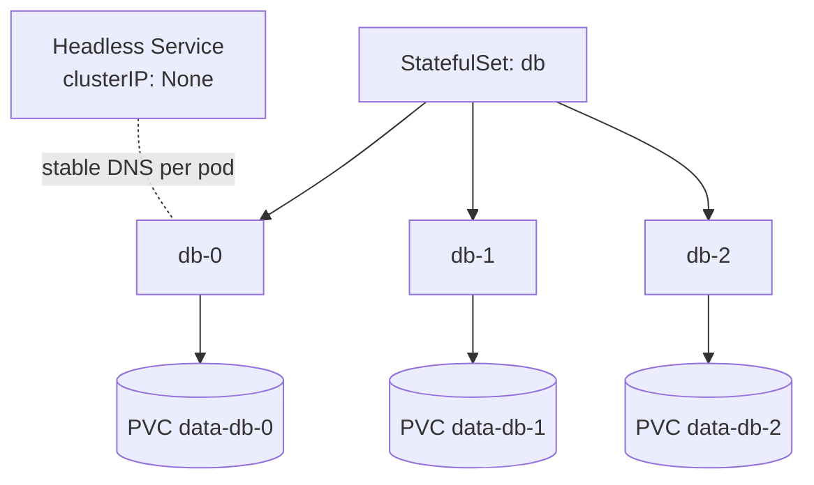

# Module 07 — Controllers: DaemonSets, Jobs, CronJobs, StatefulSets

**Goal:** know every workload controller and when to reach for each — not just
Deployments.

⏱️ ~2 hours · 🎯 Prereq: Modules 00–06.

---

## The workload controller cheat sheet

| Controller | Runs | Use for |
|------------|------|---------|
| **Deployment** | N identical, interchangeable Pods | Stateless apps (web, API) — your default |
| **StatefulSet** | N Pods with stable identity + own storage | Databases, queues, anything stateful/clustered |
| **DaemonSet** | One Pod per (selected) node | Node agents: log collectors, monitoring, CNI |
| **Job** | Pods that run to completion once | Batch tasks, migrations, one-off processing |
| **CronJob** | A Job on a schedule | Backups, reports, periodic cleanup |

---

## 1. Jobs (run to completion)

A **Job** runs one or more Pods until a specified number **complete successfully**,
then stops. Unlike a Deployment, a finished Job Pod is *not* restarted.

Key fields:
- `completions` — how many successful runs are required.
- `parallelism` — how many Pods run at once.
- `backoffLimit` — how many retries before the Job is marked failed.
- `restartPolicy: OnFailure | Never` (Jobs can't use `Always`).

```yaml
spec:
  completions: 3
  parallelism: 2
  backoffLimit: 4
  template:
    spec:
      restartPolicy: OnFailure
      containers: [...]
```

## 2. CronJobs (scheduled Jobs)

A **CronJob** creates a Job on a cron schedule.

```yaml
spec:
  schedule: "*/1 * * * *"     # standard cron: min hour dom mon dow
  jobTemplate:
    spec:
      template:
        spec:
          restartPolicy: OnFailure
          containers: [...]
```
Useful knobs: `concurrencyPolicy` (Allow/Forbid/Replace),
`successfulJobsHistoryLimit`, `startingDeadlineSeconds`.

## 3. DaemonSets (one per node)

A **DaemonSet** ensures a copy of a Pod runs on every node (or every node matching a
selector). When you add a node, it automatically gets the Pod. Perfect for
per-node agents. Your kind cluster already runs DaemonSets: `kindnet` (CNI) and
`kube-proxy`.

## 4. StatefulSets (stable identity + storage)

Deployments treat Pods as cattle — interchangeable and randomly named. But a
database replica needs a **stable identity** and **its own persistent storage**.
A **StatefulSet** provides:

- **Stable, ordinal names**: `db-0`, `db-1`, `db-2` (not random hashes).
- **Stable network identity** via a **headless Service** (`clusterIP: None`): each
  Pod is addressable at `db-0.<svc>.<ns>.svc.cluster.local`.
- **Per-Pod storage** via `volumeClaimTemplates`: each replica gets its *own* PVC
  (`data-db-0`, `data-db-1`, …) that sticks with it across restarts.
- **Ordered, graceful** rollout/scaling (`db-0` before `db-1`, etc.).



> Rule of thumb: **stateless → Deployment, stateful → StatefulSet.**

---

## Do the lab
Run a Job and a CronJob, inspect a DaemonSet, then deploy a StatefulSet and observe
stable names + per-Pod PVCs that survive deletion. 👉 **[lab.md](./lab.md)**

Then: 👉 **[challenge.md](./challenge.md)**

## Manifests
- [`job.yaml`](./manifests/job.yaml) · [`cronjob.yaml`](./manifests/cronjob.yaml)
- [`daemonset.yaml`](./manifests/daemonset.yaml)
- [`statefulset.yaml`](./manifests/statefulset.yaml) — headless Service + StatefulSet

## Key terms
Job · completions · parallelism · backoffLimit · CronJob · schedule · DaemonSet ·
StatefulSet · headless Service · volumeClaimTemplates · ordinal identity

**Next →** [Module 08: Scheduling & Scaling](../08-scheduling-and-scaling/)
