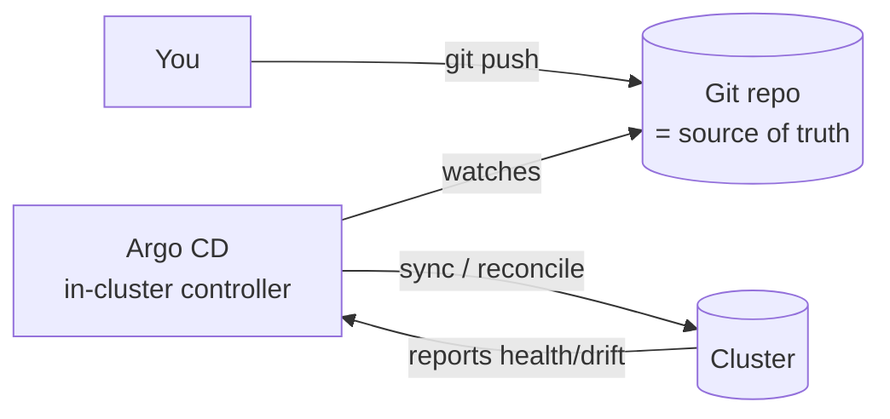

# Module 12 — Production Practices & GitOps

**Goal:** the operational layer — namespaces & quotas, zero-downtime deploys, and
**GitOps** with Argo CD where Git becomes the single source of truth for your cluster.

⏱️ ~2.5 hours · 🎯 Prereq: Modules 00–11.

---

## 1. Multi-tenancy: namespaces, quotas, limit ranges

In production you isolate teams/environments into namespaces and put guardrails on them.

- **ResourceQuota** — caps total resource use *per namespace* (e.g. "this namespace
  may request at most 4 CPU, 8Gi RAM, 20 Pods"). Prevents one team starving others.
- **LimitRange** — sets **defaults** and **min/max** for container requests/limits in
  a namespace, so Pods that forgot to set them still get sane values (and a Quota can
  be enforced).

```yaml
# ResourceQuota
spec:
  hard:
    requests.cpu: "4"
    requests.memory: 8Gi
    pods: "20"
```
```yaml
# LimitRange
spec:
  limits:
    - type: Container
      default:        { cpu: 250m, memory: 256Mi }   # applied if none specified
      defaultRequest: { cpu: 100m, memory: 128Mi }
      max:            { cpu: "1",  memory: 1Gi }
```

> With a ResourceQuota that limits `requests.cpu`, **every** Pod must declare requests
> or it's rejected — a LimitRange's `defaultRequest` keeps that ergonomic.

## 2. Zero-downtime deployments (recap + strategies)

You saw rolling updates in Module 03. Production-grade deploys also rely on:
- **readiness probes** (Module 04) — so traffic only goes to Pods that are actually
  ready; this is what *makes* a rolling update zero-downtime.
- **`maxUnavailable` / `maxSurge`** — control how aggressively Pods are replaced.
- **PodDisruptionBudget (PDB)** — guarantees a minimum number of Pods stay up during
  *voluntary* disruptions (node drains, upgrades).
- Advanced strategies (**blue/green**, **canary**) are typically done with extra
  tooling (Argo Rollouts, Flagger, service meshes) — know the terms.

```yaml
# PodDisruptionBudget: never let fewer than 2 web pods be available during drains
apiVersion: policy/v1
kind: PodDisruptionBudget
spec:
  minAvailable: 2
  selector:
    matchLabels: { app: web }
```

## 3. GitOps

**GitOps** flips deployment around: instead of *pushing* changes to the cluster with
`kubectl apply`, a controller running *in* the cluster continuously **pulls** the
desired state from a Git repo and reconciles the cluster to match it.



Benefits:
- **Git is the source of truth** — the cluster state is whatever the repo says.
- **Auditable & reversible** — every change is a commit; roll back = `git revert`.
- **Drift detection & self-heal** — manual `kubectl` changes are detected and (if
  enabled) reverted to match Git.
- **No cluster credentials on laptops/CI** — the in-cluster agent pulls; you just push to Git.

**Argo CD** is the most popular GitOps controller. Its core object is an
**Application**: "watch *this repo/path* and keep *this cluster/namespace* in sync."

## 4. CI/CD, the big picture

- **CI** (build/test/scan, push image, bump the manifest's image tag in Git) — runs
  in GitHub Actions / GitLab CI / etc.
- **CD** (apply the desired state) — with GitOps, this is just Argo CD noticing the
  commit and syncing. CI's job ends at "commit the new tag"; Argo CD does the deploy.

This repo ships a sample app under `manifests/gitops-app/` that Argo CD will deploy
straight from GitHub.

---

## Do the lab
Set quotas/limits on a namespace, add a PodDisruptionBudget, then install Argo CD,
point an Application at this repo, sync it, and watch self-heal revert manual drift.
👉 **[lab.md](./lab.md)**

Then: 👉 **[challenge.md](./challenge.md)**

## Manifests
- [`quota.yaml`](./manifests/quota.yaml) · [`limitrange.yaml`](./manifests/limitrange.yaml)
- [`pdb.yaml`](./manifests/pdb.yaml)
- [`gitops-app/`](./manifests/gitops-app/) — the app Argo CD deploys (Deployment + Service)
- [`argocd-application.yaml`](./manifests/argocd-application.yaml) — the Argo CD Application

## Key terms
ResourceQuota · LimitRange · PodDisruptionBudget · blue/green · canary · GitOps ·
source of truth · drift · self-heal · Argo CD · Application

**Next →** [Module 13: Capstone Project](../13-capstone/)
