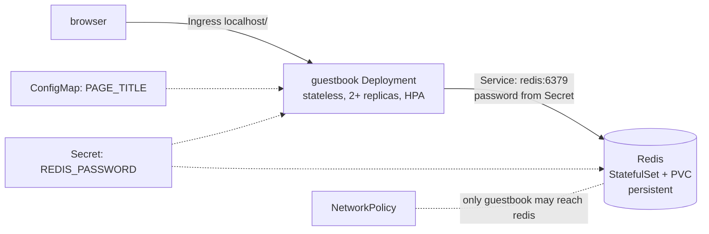

# Module 13 — Capstone Project: Ship the Guestbook

**Goal:** prove your mastery by deploying a complete, production-shaped multi-tier
app end-to-end — using everything from Modules 00–12.

⏱️ ~3+ hours · 🎯 Prereq: all prior modules.

This is **your** project. Build it yourself first. A complete reference
implementation lives in [`solutions/`](./solutions/) — use it to check yourself or
when truly stuck.

---

## The app

The [`guestbook`](../apps/guestbook/) app: a stateless Flask frontend/API backed by a
persistent Redis datastore.



## Requirements (build all of these)

**Datastore tier (Redis):**
1. A **StatefulSet** running Redis with a **PVC** (`volumeClaimTemplates`) so data
   survives Pod restarts.
2. Redis requires a password, supplied from a **Secret**.
3. A **Service** named `redis` so the app can find it by DNS.

**App tier (guestbook):**
4. A **Deployment** with **≥2 replicas**, `imagePullPolicy: Never` (local image),
   **liveness** (`/healthz`) and **readiness** (`/readyz`) probes, and **resource
   requests/limits**.
5. `PAGE_TITLE` injected from a **ConfigMap**; `REDIS_PASSWORD` from the **Secret**.
6. A **Service** for the app.
7. An **Ingress** exposing it at `http://localhost/`.
8. An **HPA** scaling the app on CPU (needs metrics-server from Module 08).

**Hardening & ops:**
9. A **NetworkPolicy** so that *only* the guestbook Pods can reach Redis on 6379.
   (Enforced only on a Calico cluster — see Module 11. Still author it.)
10. Everything in a dedicated **namespace** (`guestbook`).
11. **Bonus:** package it as a **Helm chart** *or* **Kustomize** base+overlay
    (Module 10), and/or deliver it via **Argo CD** (Module 12).

## Build path (suggested order)

1. `kind load` the image: build `guestbook:1.0` (see app README), load into kind.
2. Namespace → Secret → ConfigMap.
3. Redis StatefulSet + Service; verify it's Running and the PVC bound.
4. Guestbook Deployment + Service; verify readiness goes green (it can reach Redis).
5. Ingress; open `http://localhost/`, sign the guestbook, confirm messages persist.
6. HPA; load-test and watch it scale.
7. NetworkPolicy; (on Calico) verify a random Pod can't reach Redis but guestbook can.
8. Bonus packaging/GitOps.

## Acceptance test (prove it works)

```bash
# app reachable and writing to Redis:
curl -s -XPOST http://localhost/api/messages -H 'Content-Type: application/json' -d '{"text":"hello capstone"}'
curl -s http://localhost/api/messages        # includes "hello capstone"

# persistence: delete the Redis pod, it comes back with data intact
kubectl delete pod redis-0 -n guestbook
kubectl wait --for=condition=Ready pod/redis-0 -n guestbook --timeout=90s
curl -s http://localhost/api/messages        # message STILL there

# resilience: delete an app pod, Service keeps serving
kubectl delete pod -n guestbook -l app=guestbook --field-selector=status.phase=Running --grace-period=0 2>/dev/null
curl -s http://localhost/                      # still 200
```

---

## Mastery rubric (self-assess)

Score yourself honestly. Aim for "Solid" or better on each row before calling it done.

| Capability | Needs work | Solid | Mastery |
|------------|-----------|-------|---------|
| **Workloads** | Pods run | Deployment + StatefulSet correct | Right controller per tier, explained why |
| **Config/Secrets** | hardcoded | ConfigMap + Secret injected | Understands env-vs-file & rotation/restart |
| **Networking** | port-forward only | Services + DNS + Ingress | Debugs endpoints/selectors confidently |
| **Storage** | ephemeral | PVC persists data | Explains RWO/StatefulSet per-Pod PVCs |
| **Scaling** | manual | HPA scales on load | Tunes targets; knows requests dependency |
| **Health** | none | liveness + readiness | Diagnoses CrashLoop vs probe vs OOM |
| **Security** | default SA, root | NetworkPolicy + non-root | Least-priv RBAC + Pod Security reasoning |
| **Ops/Delivery** | `kubectl apply` | Helm/Kustomize | GitOps via Argo CD with self-heal |
| **Debugging** | guesses | `describe`/`logs` reflex | Drives the troubleshooting tree fast |

When you can deploy this app from scratch, explain every object, and debug it when
it breaks — **you've gone from zero to Kubernetes mastery.** 🎓

## What's next (beyond this course)
- Managed clusters (EKS/GKE/AKS) and the cloud-specific bits (LoadBalancers, IAM).
- Service meshes (Istio/Linkerd), progressive delivery (Argo Rollouts/Flagger).
- Operators & CRDs; Cilium/eBPF networking; policy engines (OPA/Kyverno).
- The certifications, if you want them: **CKAD**, **CKA**, **CKS**.

## Reference solution
A complete, applyable implementation + a one-shot deploy script:
👉 [`solutions/`](./solutions/) (see [`solutions/README.md`](./solutions/README.md))
