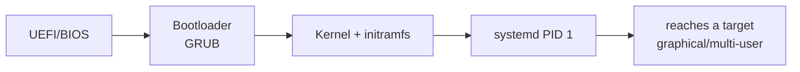

# Module 08 — Boot, systemd & Services

**Goal:** understand how Linux boots and master **systemd** — starting/stopping services,
reading logs, and writing your own unit. ⏱️ ~2.5 h · 🎯 Prereq: 00–07.

---

## 1. The boot chain


1. **UEFI/BIOS** finds a boot device.
2. **GRUB** loads the **kernel** (and an **initramfs** with early drivers).
3. The kernel mounts root and starts **PID 1 = systemd**.
4. systemd brings the system up to a **target** (set of services).

GRUB config: `/etc/default/grub` → `sudo update-grub` (Debian) / `grub2-mkconfig` (RHEL).

## 2. systemd & units

**systemd** manages everything as **units**:
| Unit type | Manages |
|-----------|---------|
| `.service` | a daemon/program (most common) |
| `.target` | a group of units (≈ old runlevels) |
| `.timer` | scheduled activation (Module 11) |
| `.mount` / `.automount` | filesystem mounts |
| `.socket` | socket-activated services |

Unit files live in: `/lib/systemd/system/` (packaged), `/etc/systemd/system/` (your
overrides — wins), and run-time `/run/systemd/system/`.

## 3. systemctl — the control tool

```bash
systemctl status sshd                 # state, PID, recent logs
sudo systemctl start|stop|restart sshd
sudo systemctl reload sshd            # re-read config without a full restart (if supported)
sudo systemctl enable sshd            # start at boot
sudo systemctl disable sshd           # don't start at boot
sudo systemctl enable --now sshd      # enable AND start now
systemctl is-enabled sshd; systemctl is-active sshd
systemctl list-units --type=service          # running services
systemctl list-unit-files --type=service     # all + their enable state
systemctl --failed                    # anything broken
sudo systemctl daemon-reload          # after editing unit files
```
> **enable ≠ start.** *enable* = "at boot"; *start* = "right now". `--now` does both.

## 4. Targets (runlevels, modern)

```bash
systemctl get-default                 # graphical.target or multi-user.target
sudo systemctl set-default multi-user.target   # boot to CLI (no GUI)
sudo systemctl isolate multi-user.target       # switch now
```
Rough mapping: `multi-user.target` ≈ runlevel 3 (CLI), `graphical.target` ≈ runlevel 5,
`rescue.target` ≈ single-user.

## 5. journald & journalctl (logs)

systemd captures logs in a binary **journal**:
```bash
journalctl -u sshd                    # logs for one unit
journalctl -u sshd -e                 # jump to the end
journalctl -f                         # follow live (all units)
journalctl -b                         # since this boot;  -b -1 = previous boot
journalctl -p err                     # priority error and worse
journalctl --since "10 min ago"
journalctl -u nginx --since today --no-pager
sudo journalctl --vacuum-time=7d      # trim old logs
```
Text logs still exist too: `/var/log/syslog` (Debian), `/var/log/messages` (RHEL),
`/var/log/auth.log` / `secure` for auth.

## 6. Write your own service

`/etc/systemd/system/hello.service`:
```ini
[Unit]
Description=Hello demo service
After=network.target

[Service]
ExecStart=/usr/local/bin/hello.sh
Restart=on-failure
User=nobody

[Install]
WantedBy=multi-user.target
```
```bash
sudo systemctl daemon-reload
sudo systemctl enable --now hello
journalctl -u hello -f
```
Key directives: `ExecStart` (command), `Restart` (on-failure/always), `User`,
`WantedBy` (which target pulls it in), `After`/`Requires` (ordering/deps).

---

## Do the lab
Manage services, switch targets, read the journal, and create a working custom unit.
👉 **[lab.md](./lab.md)**

Then: 👉 **[challenge.md](./challenge.md)**

## Code
[`code/hello.service`](./code/hello.service), [`code/hello.sh`](./code/hello.sh).

## Key terms
UEFI→GRUB→kernel→systemd · unit (`.service`/`.target`/`.timer`) · `systemctl`
start/stop/enable/`--now`/`daemon-reload` · enable vs start · target (runlevel) ·
journald/`journalctl` (`-u`/`-f`/`-b`/`-p`) · unit file directives (`ExecStart`/
`Restart`/`WantedBy`)

**Next →** [Module 09: Storage & Filesystems](../09-storage-filesystems/)
