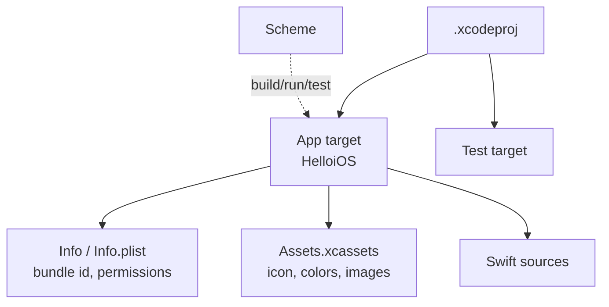

# Module 00 — Setup & Orientation

**Goal:** install Xcode, run an app in the iOS Simulator, and understand the
Cocoa/Objective-C landscape you're stepping into. ⏱️ ~45 min.

---

## 1. Install Xcode

1. Install **Xcode 16+** from the **Mac App Store** (large download, be patient).
2. Launch it once to finish component installation.
3. Install the command-line tools:
   ```bash
   xcode-select --install        # if not already present
   sudo xcodebuild -license accept
   ```
Verify:
```bash
xcode-select -p            # /Applications/Xcode.app/Contents/Developer
xcodebuild -version        # Xcode 16.x
swift --version            # Swift toolchain (bundled with Xcode)
```

> Xcode bundles the Swift toolchain, the iOS SDKs, and the Simulator. You don't install
> Swift separately on a Mac.

## 2. The buildable kata (instant feedback)

Before any UI, confirm the command-line toolchain works on the course's Swift package:
```bash
cd swift-ios-course/apps/FoundationKata
swift build
swift test
```
✅ `Build complete!` and passing tests. You'll return here to experiment with Foundation
APIs without launching Xcode.

## 3. Create & run a SwiftUI app

1. **Xcode ▸ File ▸ New ▸ Project… ▸ iOS ▸ App**.
2. Product Name `HelloiOS`, **Interface: SwiftUI**, **Language: Swift**. Create.
3. In the toolbar, choose a destination like **iPhone 16**.
4. Press **Run** (`Cmd+R`). The Simulator boots and shows "Hello, world!".
5. Open `ContentView.swift`; show the **canvas** (`Option+Cmd+Return`) for live previews.
   Edit the `Text(...)` and watch the preview update.

✅ You built and ran a native iOS app.

## 4. Project & target anatomy


- **Target** → one product (app/tests/framework); **scheme** → how to build & run it.
- **Info** tab / `Info.plist` → bundle id, permission usage strings, capabilities.
- **Assets.xcassets** → app icon, colors, images.

## 5. The Cocoa / Objective-C landscape (orientation)

The frameworks you'll use were mostly written in **Objective-C** and exposed to Swift via
**bridging**:

| Framework | Origin | You'll use it for |
|-----------|--------|-------------------|
| **Foundation** | Obj-C (NeXTSTEP `NS*`) | strings, dates, data, JSON, networking, files |
| **UIKit** | Obj-C | the original UI framework; SwiftUI bridges to it |
| **SwiftUI** | Swift (new) | your declarative UI layer |
| **Core Data** | Obj-C | persistence/object graph |
| **AVFoundation / Core Location / MapKit** | Obj-C | media, GPS, maps |

SwiftUI is the modern layer; underneath, you're constantly touching Objective-C-era
APIs. Module 03 makes that bridge explicit.

## 6. Swift Package Manager (SPM)

SPM is Swift's build/dependency tool. You already used it on `FoundationKata`. In an app,
add packages via **File ▸ Add Package Dependencies…**. See
[cheatsheets/xcode-and-spm.md](../cheatsheets/xcode-and-spm.md).

## 7. Verify
```bash
cd swift-ios-course/00-setup
./scripts/verify-setup.sh
```
Then the full [../VERIFY.md](../VERIFY.md).

---

## Troubleshooting
- **`xcrun: error: ... cannot be located`** → run `xcode-select --install` and/or
  `sudo xcode-select -s /Applications/Xcode.app/Contents/Developer`.
- **Simulator won't boot** → Xcode ▸ Settings ▸ Platforms; ensure an iOS runtime is
  installed; try a different device.
- **Preview crashes/blank** → resume the canvas; clean build (`Shift+Cmd+K`); ensure the
  scheme builds for a simulator.

---

**Next →** [Module 01: Swift Quick-Start](../01-swift-quickstart/)
