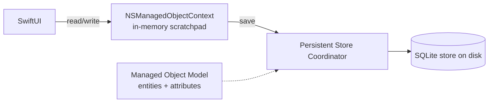

# Module 06 — Core Data & SwiftData

**Goal:** persist an object graph with **Core Data** — the classic Objective-C
persistence framework — and understand how the modern, Swift-native **SwiftData** relates
to it. ⏱️ ~3 h · 🎯 Prereq: 00–05.

---

## 1. What Core Data is (and isn't)

**Core Data** is Apple's Objective-C-era **object graph & persistence** framework. It's
*not* "a database" — it's an object layer that *can* persist to a SQLite store. It gives
you change tracking, relationships, faulting (lazy loading), undo, and querying — all in
terms of objects (`NSManagedObject`), not rows.



The pieces (`NSPersistentContainer` wires them up for you):
- **Managed Object Model** — your entities/attributes/relationships (defined in the
  Xcode `.xcdatamodeld` editor, or programmatically).
- **`NSManagedObjectContext`** — the scratchpad you read/insert/delete through; nothing
  is persisted until you `save()`.
- **`NSManagedObject`** — an instance of an entity (a "row" as an object).
- **Persistent Store Coordinator + Store** — maps objects to the SQLite file.

## 2. The stack with NSPersistentContainer

```swift
let container = NSPersistentContainer(name: "Places")   // matches the .xcdatamodeld name
container.loadPersistentStores { _, error in if let error { fatalError("\(error)") } }
let context = container.viewContext
```
> This module's [`code/CoreDataStack.swift`](./code/CoreDataStack.swift) builds the model
> **in code** (no binary `.xcdatamodeld`) so it's runnable and reviewable — but in real
> projects you'll usually use Xcode's visual model editor.

## 3. CRUD

```swift
// Create
let place = CDPlace(context: context)
place.id = UUID(); place.name = "Park"
try context.save()                          // INSERT on save

// Read (fetch request)
let request = NSFetchRequest<CDPlace>(entityName: "CDPlace")
request.predicate = NSPredicate(format: "name CONTAINS[cd] %@", "par")   // Obj-C predicate
request.sortDescriptors = [NSSortDescriptor(key: "name", ascending: true)]
let results = try context.fetch(request)

// Update — just mutate a managed object, then save
place.name = "Central Park"; try context.save()

// Delete
context.delete(place); try context.save()
```
Note the **Objective-C heritage**: `NSPredicate` (a string query language),
`NSSortDescriptor`, key strings. This is the same predicate syntax used across Cocoa.

## 4. Core Data in SwiftUI: `@FetchRequest`

SwiftUI has a property wrapper that live-queries Core Data and refreshes the view:
```swift
@Environment(\.managedObjectContext) private var context
@FetchRequest(sortDescriptors: [SortDescriptor(\CDPlace.name)])
private var places: FetchedResults<CDPlace>
```
Inject the context at the app root:
```swift
WindowGroup { ContentView() }
    .environment(\.managedObjectContext, CoreDataStack.shared.viewContext)
```

## 5. SwiftData — the modern successor

**SwiftData** (iOS 17+) is a Swift-native layer **built on Core Data**. Same engine,
far less boilerplate: annotate a class with `@Model`, no `.xcdatamodeld`, no
`NSManagedObject`:
```swift
import SwiftData

@Model final class PlaceItem {
    var id: UUID
    var name: String
    var notes: String
    init(id: UUID = UUID(), name: String, notes: String = "") { self.id = id; self.name = name; self.notes = notes }
}
```
Use it in SwiftUI:
```swift
@main struct App: App {
    var body: some Scene {
        WindowGroup { PlaceListView() }
            .modelContainer(for: PlaceItem.self)        // sets up the stack
    }
}
struct PlaceListView: View {
    @Environment(\.modelContext) private var context
    @Query(sort: \PlaceItem.name) private var places: [PlaceItem]   // live query
    // context.insert(PlaceItem(name: "Park")); context.delete(item)
}
```
| Core Data | SwiftData |
|-----------|-----------|
| `.xcdatamodeld` editor | `@Model` classes (code only) |
| `NSManagedObject` | plain `@Model` class |
| `NSManagedObjectContext` | `ModelContext` |
| `@FetchRequest` + `NSSortDescriptor` | `@Query` + key paths |
| `NSPredicate` | `#Predicate { ... }` (type-safe) |

**Why learn both?** Most existing iOS codebases you'll support use **Core Data**; new
code increasingly uses **SwiftData**. They share concepts and can even coexist.

---

## Do the lab
Persist PlacesApp two ways — a Core Data path and a SwiftData path — and prove data
survives relaunch. 👉 **[lab.md](./lab.md)**

Then: 👉 **[challenge.md](./challenge.md)**

## Reference code
[`code/CoreDataStack.swift`](./code/CoreDataStack.swift) (programmatic Core Data),
[`code/SwiftDataPlace.swift`](./code/SwiftDataPlace.swift) (SwiftData model).

## Key terms
Core Data · object graph · `NSManagedObjectModel` · `NSManagedObject` ·
`NSManagedObjectContext` · `NSPersistentContainer` · `save()` · `NSFetchRequest` ·
`NSPredicate` · `NSSortDescriptor` · `@FetchRequest` · SwiftData · `@Model` · `@Query` ·
`ModelContext` · `#Predicate`

**Next →** [Module 07: Media & Location](../07-media-and-location/)
