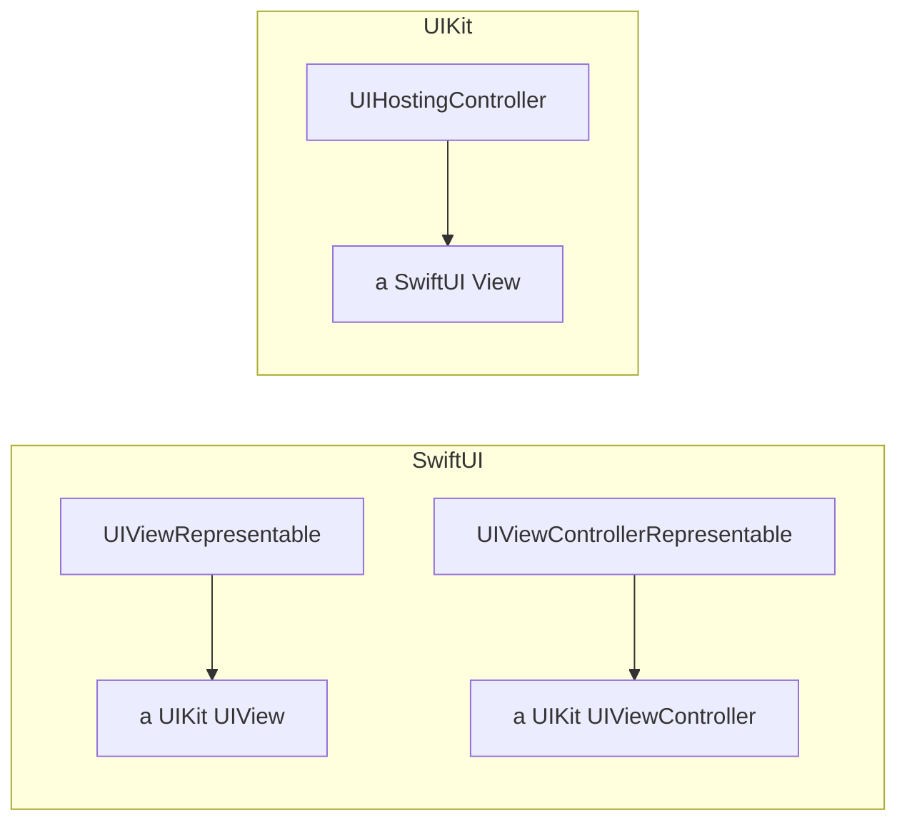

# Module 08 — UIKit ↔ SwiftUI Interop

**Goal:** bridge **UIKit** (the original Objective-C UI framework) into SwiftUI and back.
This is essential on its own — many controls only exist in UIKit — and it's the exact
mechanism you'll use to **embed Unity** in Phase 2. ⏱️ ~2.5 h · 🎯 Prereq: 00–07 (the
**delegate** pattern from 03 especially).

---

## 1. Why interop exists

SwiftUI is newer than UIKit and doesn't cover everything (`WKWebView`, camera capture
controllers, some map/scroll behaviors, and **third-party UIKit SDKs** — including
**Unity's view controller/window**). Apple gives you two wrappers to host UIKit in
SwiftUI, and one to host SwiftUI in UIKit.



## 2. `UIViewRepresentable` — wrap a UIKit view

Implement `makeUIView` (create it once) and `updateUIView` (push SwiftUI state into it):
```swift
struct WebView: UIViewRepresentable {
    let url: URL
    func makeUIView(context: Context) -> WKWebView { WKWebView() }
    func updateUIView(_ webView: WKWebView, context: Context) {
        webView.load(URLRequest(url: url))
    }
}
// use it like any View:
WebView(url: URL(string: "https://apple.com")!)
```

## 3. `UIViewControllerRepresentable` — wrap a UIKit controller

Same idea for whole view controllers (image pickers, AV capture, **Unity**):
```swift
struct CounterView: UIViewControllerRepresentable {
    @Binding var count: Int
    func makeUIViewController(context: Context) -> CounterViewController { ... }
    func updateUIViewController(_ vc: CounterViewController, context: Context) {}
    func makeCoordinator() -> Coordinator { Coordinator(count: $count) }
}
```

## 4. The Coordinator — your bridge object (= a delegate)

UIKit talks back via **delegates / target-action / closures**. The **Coordinator** is the
object that receives those callbacks and forwards them into SwiftUI state (a `@Binding`,
a closure, an `@Observable`). It's literally the delegate pattern from Module 03:

```swift
final class Coordinator {
    private let count: Binding<Int>
    init(count: Binding<Int>) { self.count = count }
    func handleCountChanged(_ newValue: Int) { count.wrappedValue = newValue }  // UIKit -> SwiftUI
}
```
- **SwiftUI → UIKit:** set properties in `updateUIViewController`.
- **UIKit → SwiftUI:** UIKit calls the Coordinator (delegate/closure) → it writes to a
  binding/state → SwiftUI re-renders.

This two-way channel is *exactly* the shape of native↔Unity messaging in Module 10.

## 5. SwiftUI inside UIKit: `UIHostingController`

Going the other way (e.g. adding a SwiftUI screen to a UIKit app, or overlaying SwiftUI
on top of a Unity view controller):
```swift
let host = UIHostingController(rootView: MySwiftUIView())
present(host, animated: true)              // or add as a child view controller
```
You'll use this in Phase 2 to put SwiftUI controls on top of the embedded Unity view.

## 6. Lifecycle & memory notes

- `make...` runs **once**; `update...` runs whenever SwiftUI state changes — keep it cheap
  and idempotent.
- The Coordinator is owned by SwiftUI for the representable's lifetime; UIKit delegates it
  references should still be `weak` where appropriate (retain cycles, Module 01).

---

## Do the lab
Wrap a `WKWebView`, an activity indicator, and a UIKit view controller that reports a
count back to SwiftUI via a Coordinator. 👉 **[lab.md](./lab.md)**

Then: 👉 **[challenge.md](./challenge.md)**

## Reference code
[`code/WebView.swift`](./code/WebView.swift),
[`code/ActivityIndicator.swift`](./code/ActivityIndicator.swift),
[`code/CounterView.swift`](./code/CounterView.swift) (controller + Coordinator).

## Key terms
`UIViewRepresentable` (`makeUIView`/`updateUIView`) · `UIViewControllerRepresentable`
(`make/updateUIViewController`) · **Coordinator** · `makeCoordinator` · `@Binding` bridge ·
target-action / delegate callbacks · `UIHostingController`

**Next →** [Module 09: Embedding Unity (UaaL)](../09-embedding-unity-uaal/)
