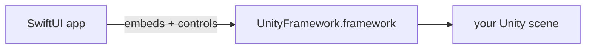

# Module 09 — Embedding Unity (Unity as a Library)

**Goal:** export a Unity iOS build and embed the **Unity runtime** inside your SwiftUI
app, launching and controlling it from native code. ⏱️ ~3 h · 🎯 Prereq: Phase 1
(especially Module 08), and the earlier Unity course (you need **Unity 6 LTS** with
**iOS Build Support**).

> ⚠️ **Read first:** UaaL is **version-sensitive**. Exact menu paths and a couple of API
> details shift between Unity/Xcode releases. This module teaches the *shape* and gives
> faithful reference code ([`unity-ios/`](../unity-ios/)); keep Unity's official
> **`uaal-example`** repo open for your exact version. None of this was compilable in the
> course authoring environment — you build it on your Mac.

---

## 1. What "Unity as a Library" means

Normally Unity builds a *whole app*. **UaaL** instead packages the Unity runtime as a
**framework** (`UnityFramework.framework`) that a **native** app embeds and controls —
so a SwiftUI app can show a Unity scene as one screen among many.



Constraints to know up front:
- Unity can be **loaded once** per process (hence a singleton bridge).
- Unity wants its own **window**; you display its `rootView`/view controller in your UI.
- It's **heavy** (memory, binary size) — load it intentionally, unload when done.
- Runs on a **device or the simulator** depending on your Unity build target; physical
  devices are the reliable path.

## 2. Step 1 — Build the Unity project for iOS

In your Unity project (from the earlier course, or a fresh one with a simple scene — a
cube is plenty):
1. **File ▸ Build Settings ▸ iOS ▸ Switch Platform**.
2. (Player Settings) set a **bundle identifier**, and for UaaL it's common to build to a
   known folder. **Build** → choose an output folder (e.g. `UnityBuild/`).
3. Unity generates an **Xcode project** containing the **`Unity-iPhone`** target and
   **`UnityFramework`** target. Building the `UnityFramework` target produces
   **`UnityFramework.framework`**.

> The cleanest UaaL setups put your SwiftUI app and the Unity-generated project into one
> **workspace**, or copy the built `UnityFramework.framework` into the app and **embed**
> it. Unity's `uaal-example` shows both; follow the one matching your Unity version.

## 3. Step 2 — Embed the framework in your SwiftUI app

1. In your app target ▸ **General ▸ Frameworks, Libraries, and Embedded Content** → add
   **`UnityFramework.framework`** and set it to **Embed & Sign**.
2. Add the data folder Unity expects (`Data`) to the app bundle as Unity's sample
   describes (it's referenced via `setDataBundleId`).
3. Add the native glue from [`unity-ios/ios/`](../unity-ios/ios/):
   `UnityBridge.swift`, `NativeCallsPlugin.mm`, and the bridging header
   `App-Bridging-Header.h` (set it as the target's **Objective-C Bridging Header**).

## 4. Step 3 — Control Unity from Swift

[`UnityBridge.swift`](../unity-ios/ios/UnityBridge.swift) wraps the lifecycle:
```swift
UnityBridge.shared.show()      // load + run (first time) or re-show
UnityBridge.shared.pause(true) // pause the runtime
UnityBridge.shared.unload()    // tear down (frees most memory)
```
Key `UnityFramework` calls it uses:
- `UnityFramework.getInstance()` — the singleton.
- `setDataBundleId("com.unity3d.framework")` — where Unity finds its data.
- `runEmbedded(withArgc:argv:appLaunchOpts:)` — start it embedded.
- `showUnityWindow()` / `pause(_:)` / `unloadApplication()` — control it.
- `appController()?.rootView` — the view you host in SwiftUI.
- One gotcha: Unity needs the app's Mach-O header via `setExecuteHeader(&_mh_execute_header)`
  — set it from a tiny Obj-C shim (Swift can't reach `_mh_execute_header` cleanly). See the
  note in `UnityBridge.swift`.

## 5. Step 4 — Show Unity in SwiftUI

[`UnityContainerView.swift`](../unity-ios/ios/UnityContainerView.swift) hosts Unity's
`rootView` via the **`UIViewControllerRepresentable`** pattern from Module 08:
```swift
struct UnityScreen: View {
    var body: some View {
        UnityContainerView()
            .ignoresSafeArea()
    }
}
```
Launching it from a button keeps Unity from loading until needed:
```swift
@State private var showUnity = false
Button("Launch Unity") { showUnity = true }
.fullScreenCover(isPresented: $showUnity) {
    ZStack(alignment: .topTrailing) {
        UnityScreen()
        Button("Close") { UnityBridge.shared.unload(); showUnity = false }.padding()
    }
}
```

---

## Do the lab
Build a Unity iOS framework, embed it, and launch a Unity scene from a SwiftUI button.
👉 **[lab.md](./lab.md)**

Then: 👉 **[challenge.md](./challenge.md)**

## Reference code
[`unity-ios/ios/UnityBridge.swift`](../unity-ios/ios/UnityBridge.swift),
[`unity-ios/ios/UnityContainerView.swift`](../unity-ios/ios/UnityContainerView.swift).

## Key terms
Unity as a Library (UaaL) · `UnityFramework.framework` · Embed & Sign · `getInstance()` ·
`setDataBundleId` · `runEmbedded` · `showUnityWindow`/`pause`/`unloadApplication` ·
`appController().rootView` · `setExecuteHeader` · single-load constraint

**Next →** [Module 10: Swift ↔ Unity Communication & Capstone](../10-unity-capstone/)
