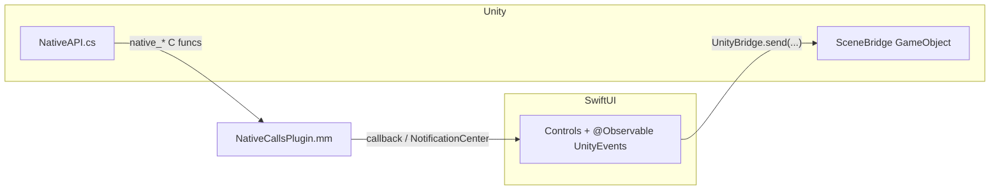

# Module 10 — Swift ↔ Unity Communication & Capstone

**Goal:** complete the two-way bridge — send commands **into** Unity and receive
callbacks **back** in SwiftUI — and ship a capstone app where a SwiftUI control panel
drives an embedded Unity scene. ⏱️ ~3+ h · 🎯 Prereq: 08, 09.

> Same version-sensitivity caveats as Module 09. Reference code:
> [`unity-ios/`](../unity-ios/).

---

## 1. The two directions



This is the **Coordinator** pattern from Module 08, scaled to a different engine.

## 2. SwiftUI → Unity: `sendMessage`

Call a method on a named Unity `GameObject`:
```swift
UnityBridge.shared.send(toObject: "SceneBridge", method: "SetColor", message: "1,0,0")
UnityBridge.shared.send(toObject: "SceneBridge", method: "Spawn", message: "")
```
On the Unity side, [`SceneBridge.cs`](../unity-ios/unity/SceneBridge.cs) is attached to a
GameObject **named exactly `SceneBridge`**, with public methods taking a single `string`:
```csharp
public void SetColor(string rgb) { /* parse "r,g,b" -> material color */ }
public void Spawn(string _)       { /* spawn + report score back */ }
```
> Rule: methods invoked via `sendMessage` must be **public**, on a MonoBehaviour, and take
> **0 or 1 string** parameter. The GameObject name must match exactly.

## 3. Unity → SwiftUI: extern C + plugin

Unity (C#) calls native functions declared `[DllImport("__Internal")]` in
[`NativeAPI.cs`](../unity-ios/unity/NativeAPI.cs):
```csharp
[DllImport("__Internal")] static extern void native_sendScore(int score);
public static void SendScore(int s) { native_sendScore(s); }
```
Those C functions are implemented in
[`NativeCallsPlugin.mm`](../unity-ios/ios/NativeCallsPlugin.mm) (added to the **app**
target), which forwards to Swift via a registered callback and `NotificationCenter`:
```objc
void native_sendScore(int score) { if (g_scoreHandler) g_scoreHandler(score); }
void native_sendMessage(const char* m) { /* post "UnityMessage" notification */ }
```
The bridging header [`App-Bridging-Header.h`](../unity-ios/ios/App-Bridging-Header.h)
exposes these to Swift. [`UnityEvents`](../unity-ios/ios/UnityContainerView.swift)
observes them and republishes as `@Observable` properties (`score`, `lastMessage`).

## 4. Why a registered callback + NotificationCenter?

`@convention(c)` function pointers (what C expects) **can't capture Swift state**. So the
score handler is a non-capturing C closure that simply posts a `Notification`; an
`@Observable` object listens and updates SwiftUI. String messages use `NotificationCenter`
directly. This keeps Unity→native callbacks flowing into SwiftUI cleanly.

## 5. The capstone

[`code/CapstoneUnityView.swift`](./code/CapstoneUnityView.swift): a SwiftUI screen with
Unity on top and a control panel below that:
- sends a **color** to the Unity cube (`SetColor`) from a SwiftUI `ColorPicker`,
- triggers **Spawn** in Unity,
- shows the **score** and **status message** Unity sends back,
- can **unload** Unity.

That's a complete, bidirectional SwiftUI ⟷ Unity app — the goal of the course.

---

## Do the lab
Wire both directions and build the capstone control panel. 👉 **[lab.md](./lab.md)**

Then: 👉 **[challenge.md](./challenge.md)** and the
[mastery rubric](./solutions/RUBRIC.md).

## Reference code
[`unity-ios/unity/`](../unity-ios/unity/) (C#),
[`unity-ios/ios/`](../unity-ios/ios/) (Swift/Obj-C),
[`code/CapstoneUnityView.swift`](./code/CapstoneUnityView.swift).

## Key terms
`sendMessageToGOWithName:functionName:message:` · GameObject name match ·
`[DllImport("__Internal")]` · extern C plugin (`.mm`) · `@convention(c)` ·
bridging header · `NotificationCenter` bridge · `@Observable` republish

**This is the final module.** See the rubric for self-assessment and next steps.
