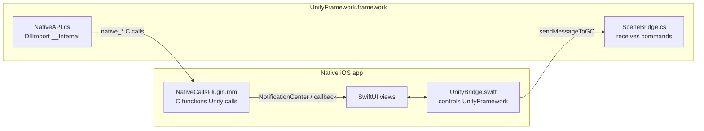

# Unity-as-a-Library Bridge (iOS)

The code that connects a **SwiftUI app** and an embedded **Unity** runtime. Used in
Modules 09 (embedding) and 10 (two-way messaging + capstone).

> ⚠️ **Honest note:** Unity-as-a-Library (UaaL) integration is **version-sensitive** —
> exact Xcode steps and a few API details change between Unity releases. This code follows
> the well-documented UaaL pattern (Unity 6 LTS) and is heavily commented, but treat
> Unity's official `uaal-example` as the source of truth for your version. I could not
> compile any of this in the authoring environment (no Xcode/Unity); you build it on your
> Mac.

## The big picture

- **SwiftUI → Unity:** `UnityBridge` calls `sendMessageToGOWithName(...)` to invoke a
  method on a Unity `GameObject` (`SceneBridge`).
- **Unity → SwiftUI:** `NativeAPI.cs` calls C functions (`[DllImport("__Internal")]`)
  implemented in `NativeCallsPlugin.mm`, which forward into Swift (via a registered
  callback / `NotificationCenter`).

## Files
| File | Side | Role |
|------|------|------|
| `unity/NativeAPI.cs` | Unity (C#) | Declares the extern C calls; Unity → native |
| `unity/SceneBridge.cs` | Unity (C#) | A GameObject that receives native → Unity commands |
| `ios/UnityBridge.swift` | Native (Swift) | Loads/launches/controls `UnityFramework` |
| `ios/NativeCallsPlugin.mm` | Native (Obj-C++) | Implements the C functions Unity calls |
| `ios/App-Bridging-Header.h` | Native | Exposes the plugin's C functions to Swift |
| `ios/UnityContainerView.swift` | Native (SwiftUI) | Shows Unity's view in SwiftUI + observes callbacks |

## Integration order (summary — details in Modules 09–10)
1. In Unity: add `NativeAPI.cs` + `SceneBridge.cs`; build for **iOS** → get an Xcode
   project containing **`UnityFramework.framework`**.
2. In your app's Xcode project: embed `UnityFramework.framework`; add
   `NativeCallsPlugin.mm` + the bridging header; add `UnityBridge.swift` and
   `UnityContainerView.swift`.
3. Launch Unity from SwiftUI; send messages in; receive callbacks out.
